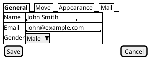
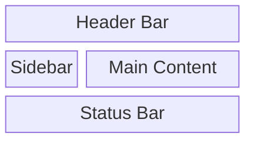

---

id: RES-11bee8a4
type: research
title: Wireframing Tool Research
description: Text-based wireframing tools suitable for AI-agent-driven UX design. Evaluates 8 tools against 10 requirements.
status: completed
created: 2026-03-02
updated: 2026-03-07
relationships: []
---
**Date:** 2026-03-02 | **Status:** Complete

Research into text-based wireframing tools suitable for AI-agent-driven UX design during OrqaStudio's Phase 0d.

---

## Context

OrqaStudio's Phase 0d (UX Design) requires generating wireframe images for core layouts, conversation views, artifact browsers, settings, and dashboards. These wireframes will be embedded as PNG/SVG images in markdown documentation under `docs/ui/`.

The wireframing tool must be usable by an AI agent (Claude) during development sessions — this means the tool must accept a **text-based input format** (not a GUI-only tool), output **image files** (PNG or SVG), and ideally support **theming** so wireframes can match OrqaStudio's eventual design system.

ImagineUI (https://imagineui.github.io/en/) was the initial candidate. This research validates that choice and compares alternatives.

---

## Requirements

| # | Requirement | Weight |
|---|---|---|
| R1 | Text-based input format (DSL, JSON, markup) — generatable by AI agents | Must |
| R2 | Image output (PNG and/or SVG) embeddable in markdown | Must |
| R3 | CLI or programmatic API (no GUI required) | Must |
| R4 | Customizable styling (colors, fonts, spacing, theming) | Should |
| R5 | Offline / bundleable (no cloud dependency) | Should |
| R6 | UI-specific vocabulary (buttons, text fields, panels, tabs, menus, sidebars) | Should |
| R7 | Layout control (columns, rows, grids, nesting) | Should |
| R8 | Active maintenance and community | Should |
| R9 | Permissive license (MIT, Apache, MPL) | Should |
| R10 | AI agent can reliably generate the input format without frequent errors | Should |

---

## Evaluated Tools

### 1. ImagineUI

**What it is:** A CLI tool that generates wireframe images from a "localized human-readable format" using `.scene` files. Designed specifically for UI mockups.

**Repository:** https://github.com/imagineui/imagineui
**License:** MIT
**Stars:** ~162
**Last commit:** March 2024 (over a year ago)
**Status:** Self-described as "Early alpha. Things may break."

**Input format:** Custom DSL using `.scene` files with natural-language-like syntax:
```
Page: Authorization

Main block: Login
  Image logo
  Header: Welcome
  Field: Email
  Field: Password
  Button: Sign In

Service block: Help
  Button: Forgot password?
  Button: Create account
```

Elements include: Page, Block, Header, Field, Button, Image, List, Text. Layout via `Rows`, `Columns`, `Aligned` keywords. The `.guide` files provide target-specific rendering instructions (resolution, UI guidelines).

**Output format:** PNG (via Puppeteer-based headless browser rendering)

**CLI usage:**
```bash
npx imagineui-cli --input=path/to/file.scene --outputDir=path/to/output/
```

**Theming/styling:** Extremely limited. No documented support for colors, fonts, spacing, or custom themes. The tool renders a fixed low-fidelity wireframe style. No `skinparam`, `style`, or theme configuration.

**AI agent reliability:** The natural-language DSL is intuitive but **poorly documented**. The official documentation site (imagineui.io) is down (ECONNREFUSED). The sandbox requires JavaScript and cannot be inspected for examples. The DSL syntax rules are not formally specified — an AI agent would have to guess at valid syntax. Known limitation: the `.scene` format cannot express complex layouts like sidebars alongside multi-column content, element positioning within repeating blocks, or image sizing (per GitHub issue #8).

**Bundling:** Requires Node.js + Puppeteer (headless Chromium). Heavy dependency (~400MB for Chromium). Can run offline once installed.

**Assessment:**
- (+) Purpose-built for wireframes with UI-specific vocabulary
- (+) Natural language DSL is easy to read
- (+) MIT license
- (-) **Abandoned** — no commits in over a year, alpha status, 162 stars
- (-) **Documentation is offline/broken** — imagineui.io is down
- (-) **No theming or styling** support whatsoever
- (-) **Poorly specified DSL** — no formal grammar, limited examples available
- (-) **Layout limitations** — cannot do complex multi-pane layouts needed for OrqaStudio wireframes
- (-) Heavy Puppeteer/Chromium dependency
- (-) PNG only (no SVG)

**Verdict: Not recommended.** The project is effectively abandoned, the documentation is broken, the DSL is under-specified for reliable AI generation, and it lacks the layout complexity and theming needed for OrqaStudio.

---

### 2. PlantUML Salt

**What it is:** A subproject of PlantUML specifically designed for GUI wireframes and screen mockups. Part of the mature PlantUML ecosystem.

**Website:** https://plantuml.com/salt
**License:** GPL/LGPL/Apache/EPL/MIT (multi-licensed — LGPL version available for commercial bundling without source disclosure, as long as the jar is unmodified)
**Stars:** ~10.5k (main PlantUML repo)
**Maintenance:** Actively maintained. PlantUML has continuous releases.

**Input format:** Text-based DSL wrapped in `@startsalt` / `@endsalt` blocks:


**Available UI elements:**
- Buttons: `[Button Text]`
- Text input fields: `"placeholder text"`
- Radio buttons: `()` unchecked, `(X)` checked
- Checkboxes: `[]` unchecked, `[X]` checked
- Droplists: `^Selected Item^`
- Tabs: `{/ Tab1 | Tab2 | Tab3 }`
- Menus: `{* File | Edit | View }`
- Tree widgets: `{T` with `+` hierarchy notation
- Scrollbars: `{S`, `{SI`, `{S-`
- Group boxes: `{^"Title"` for framed sections
- Separators: `..`, `==`, `~~`, `--`
- Text areas: `{+` with spacing controls
- OpenIconic icons: `<&icon_name>`

**Layout system:**
- Grid/table: `{` opens container, `|` separates columns
- Line modes: `#` (all lines), `!` (vertical only), `-` (horizontal only), `+` (external only)
- Cell spanning with `*` and empty cells with `.`
- Nested containers via nested `{}`
- No explicit row/column count — layout is implicit from `|` usage

**Output formats:** PNG (default), SVG (`-tsvg` flag), PDF, EPS

**CLI usage:**
```bash
java -jar plantuml.jar -tpng diagram.puml
java -jar plantuml.jar -tsvg diagram.puml
cat diagram.puml | java -jar plantuml.jar -pipe -tsvg > output.svg
```

**Theming/styling:**
- Color support: `<color:Blue>Text` or `<color:#9a9a9a>Text`
- Text formatting: `**bold**`, `//italic//`, `""monospaced""`, `--strikethrough--`, `__underlined__`
- `skinparam` commands for background colors, fonts (being deprecated)
- New CSS-like `<style>` blocks for modern styling (replacing skinparam)
- Scale command for output size control
- Theme gallery available at https://the-lum.github.io/puml-themes-gallery/
- Font control via `skinparam defaultFontName` (system-dependent portability)

**AI agent reliability:** HIGH. The DSL is well-documented with extensive examples. The syntax is concise and rule-based (not ambiguous natural language). PlantUML has been widely used by AI models — Claude and other LLMs can generate PlantUML Salt reliably. The element vocabulary maps directly to standard UI components.

**Bundling:** Requires Java runtime (JRE). The `plantuml.jar` file is ~10MB. Runs fully offline. Since wireframing is a first-class product feature (not just a dev tool), the JRE must be bundled with OrqaStudio or compiled to a native binary via GraalVM. See Open Questions for bundling options.

**Assessment:**
- (+) **Purpose-built for wireframes** with rich UI element vocabulary
- (+) **Excellent documentation** — extensive examples, cheat sheets, community resources
- (+) **Mature and actively maintained** — decades of development, large community
- (+) **Multi-format output** — PNG, SVG, PDF
- (+) **Theming and styling** — colors, fonts, CSS-like styles, theme gallery
- (+) **AI agents generate PlantUML reliably** — well-known format, widely in training data
- (+) **Offline capable** — single JAR, no cloud dependency
- (+) **Multi-licensed** — LGPL version allows commercial bundling
- (-) Requires Java runtime (adds ~50MB dependency)
- (-) Layout system is grid-based but lacks explicit multi-column page layouts
- (-) Wireframe aesthetic is functional but not visually refined
- (-) No explicit "sidebar + main content" layout primitive — must be composed with nested grids

**Verdict: Strong candidate.** Best combination of wireframe-specific features, documentation quality, AI reliability, and theming support.

---

### 3. D2 (Declarative Diagramming)

**What it is:** A modern diagram scripting language focused on software architecture diagrams, flowcharts, and structural visualization. Written in Go.

**Repository:** https://github.com/terrastruct/d2
**License:** Mozilla Public License 2.0 (MPL-2.0)
**Stars:** ~23.1k
**Last active:** Actively maintained with 5,095+ commits
**Company:** Terrastruct (commercial entity behind it)

**Input format:** Declarative text DSL (`.d2` files):
```d2
server: {
  label: Web Server
  web: Web Application
  api: API Gateway
  db: Database

  web -> api: REST
  api -> db: SQL
}
```

**Grid layout capability:**
```d2
layout: {
  grid-rows: 2
  grid-columns: 3
  grid-gap: 10
  vertical-gap: 5
  horizontal-gap: 10
}
```

Supports nested grids (children of grid cells can themselves be grids), gap control, cell width/height specification, and fill direction.

**Output formats:** SVG (default), PNG, PDF, GIF (animated)

**CLI usage:**
```bash
d2 input.d2 output.svg
d2 --watch input.d2 output.svg  # live reload
d2 -t 200 input.d2 output.png  # with theme ID
```

**Theming/styling:**
- Multiple built-in themes (light and dark variants)
- `--dark-theme` flag for automatic dark mode adaptation
- `theme-overrides` and `dark-theme-overrides` for custom color codes
- Per-element style blocks: `style.fill`, `style.stroke`, `style.font-color`, `style.border-radius`, `style.fill-pattern`
- Default font: Source Sans Pro (configurable)
- `d2 --list-themes` to see all available themes

**Layout engines:**
- Dagre (default, bundled) — hierarchical graph layout
- ELK (bundled) — node-link directional flow
- TALA (separate binary) — proprietary, designed for architecture diagrams

**AI agent reliability:** HIGH. The DSL is clean, well-documented, and syntactically simple. D2 has good error messages for malformed input. The language is deterministic and rule-based.

**Bundling:** Single Go binary. ~20MB. No runtime dependencies. Cross-platform (Windows, macOS, Linux). Install via curl script, Homebrew, or precompiled binaries. Can also be used as a Go library.

**Assessment:**
- (+) **Excellent theming** — built-in themes, dark mode, granular style overrides
- (+) **Grid layout system** — row/column/gap control for structured layouts
- (+) **Multiple output formats** — SVG, PNG, PDF
- (+) **Single binary, no dependencies** — easiest bundling story
- (+) **Very actively maintained** — 23k stars, corporate backing
- (+) **AI-friendly syntax** — clean, deterministic, well-documented
- (+) Live watch mode for iterative development
- (-) **Not designed for wireframes** — no UI-specific vocabulary (buttons, text fields, checkboxes, tabs, menus)
- (-) Grid diagrams are for structural layout, not UI mockup rendering
- (-) No concept of "interactive elements" — everything is boxes, connections, and labels
- (-) Creating a wireframe requires manually composing boxes with labels to approximate UI elements
- (-) MPL-2.0 license is permissive but requires sharing modifications to D2 source files (file-level copyleft)

**Verdict: Not recommended for wireframes specifically.** D2 is an excellent diagramming tool and would be ideal for architecture diagrams, system diagrams, and flow diagrams in OrqaStudio's documentation. However, it lacks UI-specific vocabulary, making wireframe creation verbose and unreliable — every button, text field, and checkbox must be manually approximated with generic shapes.

---

### 4. Mermaid

**What it is:** A JavaScript-based diagramming tool that renders markdown-like text into diagrams. Widely supported in GitHub, GitLab, Notion, and many markdown renderers.

**Repository:** https://github.com/mermaid-js/mermaid
**License:** MIT
**Stars:** ~85k+
**Maintenance:** Very actively maintained, large contributor base

**Input format:** Markdown-like text DSL with multiple diagram types:


**Relevant diagram types for wireframes:**
- **Block diagrams** (`block-beta`) — CSS-grid-style layout with column spanning
- **Flowcharts** — boxes and connections
- No dedicated wireframe diagram type (GitHub issue #1184 is approved but unimplemented)

**Block diagram features:**
- Column count specification
- Column spanning (`:2`, `:3`)
- Multiple shape types: rectangle, rounded, stadium, cylinder, circle, diamond, hexagon
- Nested/composite blocks
- Edge connections with labels
- CSS-based styling: `style A fill:#ff9999,stroke:#333`
- Class definitions: `classDef blue fill:#0099ff`

**Output formats:** SVG (primary, rendered in browser), PNG (via `@mermaid-js/mermaid-cli` / `mmdc`)

**CLI usage:**
```bash
npx @mermaid-js/mermaid-cli -i diagram.mmd -o output.svg
npx @mermaid-js/mermaid-cli -i diagram.mmd -o output.png -b transparent
```

**Theming/styling:**
- Built-in themes: `default`, `dark`, `forest`, `neutral`, `base`
- Theme variables for fine-grained control (primary/secondary colors, fonts, etc.)
- Per-element CSS styling
- `%%{init: {'theme': 'dark'}}%%` directive for theme selection

**AI agent reliability:** HIGH. Mermaid is one of the most common diagram formats generated by AI models. Claude generates Mermaid reliably. However, the `block-beta` diagram type is newer and less well-known — AI reliability is moderate for block diagrams specifically.

**Bundling:** Requires Node.js + Puppeteer (for CLI/PNG export). Can also render client-side in browser. The mermaid-cli uses headless Chromium (~400MB).

**Assessment:**
- (+) **Ubiquitous** — supported in GitHub markdown, many renderers
- (+) **AI agents generate Mermaid very reliably** — most common diagram format in LLM training data
- (+) **MIT license**
- (+) **Block diagrams offer grid-like layout** with column spanning
- (+) **Good theming** — multiple themes, CSS customization
- (+) Very actively maintained with massive community
- (-) **No wireframe diagram type** — issue #1184 approved but not implemented
- (-) **Block diagrams are rudimentary** — no UI element vocabulary (buttons, fields, tabs)
- (-) **No interactive element rendering** — everything is generic shapes with text
- (-) CLI requires Puppeteer/Chromium for PNG export (heavy)
- (-) Block diagrams are `block-beta` — still in beta, syntax may change

**Verdict: Not recommended for wireframes.** Like D2, Mermaid is excellent for flowcharts, sequence diagrams, and architecture diagrams, but lacks UI-specific vocabulary. Block diagrams can approximate layouts but cannot render recognizable wireframe elements. Best used alongside a wireframe tool for other diagram types.

---

### 5. Excalidraw

**What it is:** A virtual whiteboard for hand-drawn-style diagrams. Primarily a web/GUI tool with JSON-based file format and emerging programmatic APIs.

**Repository:** https://github.com/excalidraw/excalidraw
**License:** MIT
**Stars:** ~118k
**Last release:** v0.18.0 (March 2025)
**Maintenance:** Very actively maintained

**Input format:** JSON (`.excalidraw` files):
```json
{
  "type": "excalidraw",
  "version": 2,
  "elements": [
    {
      "type": "rectangle",
      "x": 10, "y": 10,
      "width": 200, "height": 40,
      "strokeColor": "#000000",
      "backgroundColor": "#e0e0e0",
      "boundElements": [{"type": "text", "id": "text1"}]
    },
    {
      "type": "text",
      "id": "text1",
      "x": 60, "y": 20,
      "text": "Button",
      "fontSize": 16,
      "fontFamily": 1
    }
  ],
  "appState": { "viewBackgroundColor": "#ffffff" }
}
```

**Element types:** rectangle, ellipse, diamond, text, arrow, line, freedraw, image

**Output formats:** PNG, SVG (via export utilities)

**CLI/programmatic rendering:**
- `@excalidraw/utils` — Node.js export utilities (SVG)
- `excalidraw-brute-export-cli` — Playwright+Firefox headless export to PNG/SVG
- `excalidraw-to-svg` — Node.js library using jsdom
- `excalidraw-render` — headless Chromium renderer
- All CLI tools require a headless browser for PNG rendering

**Theming/styling:** Full CSS-level control — every element has `strokeColor`, `backgroundColor`, `fontSize`, `fontFamily`, `roughness` (0 for clean, 1+ for hand-drawn), `strokeWidth`, `opacity`, etc. Complete programmatic control over appearance.

**AI agent reliability:** LOW-MODERATE. The JSON format is verbose — each element requires explicit x/y positioning, width/height, IDs, and element references. An AI agent must calculate pixel positions for every element, handle text binding to shapes, and manage element IDs. This is error-prone and tedious. There is no automatic layout engine — the AI must do all spatial math.

**Bundling:** The file format is portable JSON. Rendering requires a browser environment (headless Chromium/Firefox for CLI export). Heavy dependency.

**Assessment:**
- (+) **Complete styling control** — pixel-level positioning, colors, fonts, roughness
- (+) **Beautiful hand-drawn aesthetic** when roughness > 0
- (+) **MIT license**
- (+) **Massive community** — 118k stars, very well maintained
- (+) JSON is a universal format
- (-) **No automatic layout** — AI must calculate every pixel position
- (-) **No UI element vocabulary** — everything is primitive shapes
- (-) **Verbose JSON format** — a simple button requires ~20 lines of JSON
- (-) **AI reliability is poor** — manual coordinate calculation is error-prone
- (-) **Heavy rendering dependency** — headless browser required for export
- (-) **No declarative layout** — no grids, columns, rows, or flow

**Verdict: Not recommended.** While Excalidraw produces beautiful output, the lack of automatic layout and the requirement for pixel-level coordinate math makes it unsuitable for AI agent generation. A simple 5-element wireframe would require hundreds of lines of carefully coordinated JSON.

---

### 6. Kroki (Meta-tool / Rendering Service)

**What it is:** A unified API that renders multiple diagram formats (including PlantUML, Mermaid, D2, Excalidraw, and many others) to SVG/PNG. Can be self-hosted or used as a public service.

**Repository:** https://github.com/yuzutech/kroki
**License:** MIT
**Maintenance:** Actively maintained

**How it works:** Kroki accepts diagram source in any supported format via HTTP API and returns rendered images. It acts as a rendering proxy — you still write PlantUML Salt, D2, Mermaid, etc. as the input format.

**Self-hosted:** Docker Compose with companion containers for each rendering engine.

**Assessment:** Kroki is a rendering service, not a diagram language. It does not add wireframe capabilities — it merely renders existing formats. Could be useful as a rendering backend if OrqaStudio wanted to support multiple diagram types, but does not solve the wireframe input problem. Adds deployment complexity (Docker containers) without adding design capabilities.

**Verdict: Not applicable.** Kroki is a rendering service, not a wireframing tool. It could serve as infrastructure if we needed server-side rendering of multiple diagram formats, but it doesn't address the core question of wireframe input format.

---

### 7. wireframe.cc

**What it is:** A browser-based low-fidelity wireframing tool with a minimal, sketch-like interface.

**Assessment:** GUI-only. No CLI, no API, no text-based input format, no programmatic access. Cannot be used by an AI agent.

**Verdict: Disqualified.** Fails R1 (text input), R3 (CLI/API).

---

### 8. ASCII Art to SVG (GoAT, asciitosvg, aasvg)

**What it is:** Tools that convert ASCII art diagrams into SVG images.

**Example tools:**
- **GoAT** (`github.com/blampe/goat`) — Go binary, renders ASCII art to multi-colored SVG, supports CSS styling
- **asciitosvg** (`github.com/asciitosvg/asciitosvg`) — Go binary, ASCII to SVG
- **aasvg** — npm package, ASCII art to SVG

**Input format:** Plain ASCII art:
```
+------------------+---------------------------+
|     Sidebar      |       Main Content        |
|                  |                           |
|  [Agents]        |   +-------------------+   |
|  [Rules]         |   | Conversation      |   |
|  [Skills]        |   |                   |   |
|                  |   +-------------------+   |
+------------------+---------------------------+
```

**Assessment:**
- (+) ASCII art is trivially easy for AI agents to generate
- (+) Single Go binary (GoAT), no dependencies
- (+) Works offline
- (-) **Extremely limited styling** — ASCII art has no concept of colors, fonts, or theming
- (-) **No UI element vocabulary** — everything is text and box-drawing characters
- (-) **Fragile layout** — ASCII art breaks if column widths don't align perfectly
- (-) **Low fidelity** — output looks like ASCII art, not a wireframe
- (-) No interactive elements (buttons, fields, etc.) — just boxes and text

**Verdict: Not recommended as primary tool.** Could supplement wireframes as quick ASCII sketches, but the output quality and lack of theming make it unsuitable as the primary wireframing approach. The AI agent would also need to carefully manage character-level alignment, which is more fragile than a structured DSL.

---

## Comparison Matrix

| Criterion | ImagineUI | PlantUML Salt | D2 | Mermaid | Excalidraw | ASCII-to-SVG |
|---|---|---|---|---|---|---|
| **UI element vocabulary** | Good | **Excellent** | None | None | None | None |
| **Layout system** | Limited | Grid/table | Grid | Block grid | Manual xy | ASCII grid |
| **Output: PNG** | Yes | Yes | Yes | Yes (CLI) | Yes (CLI) | No |
| **Output: SVG** | No | Yes | Yes | Yes | Yes (CLI) | Yes |
| **Theming/colors** | None | **Good** | **Excellent** | Good | **Excellent** | None |
| **AI reliability** | Low | **High** | High | High* | Low | Moderate |
| **CLI available** | Yes | Yes | Yes | Yes | Yes** | Yes |
| **Offline capable** | Yes | Yes | **Yes** | Yes | Yes | **Yes** |
| **Dependencies** | Node+Puppeteer | Java | **None** | Node+Puppeteer | Node+Browser | **None** |
| **License** | MIT | Multi (LGPL ok) | MPL-2.0 | MIT | MIT | MIT |
| **Active maintenance** | **Dead** | Active | **Very active** | **Very active** | **Very active** | Varies |
| **Stars** | 162 | ~10.5k | ~23k | ~85k | ~118k | <1k |

\* Mermaid's block-beta is newer and less reliably generated than flowcharts/sequence diagrams.
\** Excalidraw CLI tools are third-party, not official.

---

## Recommendation

**Primary wireframing tool: PlantUML Salt**

PlantUML Salt is the clear winner for OrqaStudio's wireframing needs:

1. **Purpose-built for wireframes** — It has native vocabulary for buttons, text fields, checkboxes, radio buttons, tabs, menus, trees, scrollbars, and dropdowns. No other evaluated tool has this.

2. **AI agents generate PlantUML reliably** — PlantUML is one of the most widely-known diagram formats. Claude can generate Salt wireframes with high accuracy. The syntax is concise, rule-based, and well-documented.

3. **Multi-format output** — Both PNG and SVG via simple CLI flags (`-tpng`, `-tsvg`).

4. **Theming and styling** — CSS-like `<style>` blocks, color directives, font control, and a theme gallery. Sufficient to align wireframes with OrqaStudio's design tokens.

5. **Mature and maintained** — PlantUML has been in active development for over a decade with continuous releases, extensive documentation, and a large community.

6. **Offline capable** — Single JAR file, runs anywhere with a JRE.

7. **License** — LGPL version allows commercial bundling without source disclosure (as long as the JAR is unmodified). Generated images have no license requirements.

**Secondary tool: D2**

D2 should be adopted for non-wireframe diagrams in OrqaStudio's documentation:
- Architecture diagrams
- System flow diagrams
- Data flow / pipeline diagrams
- Component relationship diagrams

D2's superior theming, single-binary distribution, and excellent grid layout make it ideal for structural diagrams. It complements PlantUML Salt — Salt for UI wireframes, D2 for system diagrams.

**Workflow:**

```bash
# Generate wireframe PNG from Salt file
java -jar plantuml.jar -tpng docs/wireframes/core-layout.puml -o docs/wireframes/

# Generate architecture SVG from D2 file
d2 docs/architecture/diagrams/streaming-pipeline.d2 docs/architecture/diagrams/streaming-pipeline.svg
```

**Why not ImagineUI:** The project is abandoned (no commits since March 2024), documentation is offline, the DSL is under-specified, it has no theming support, and its layout system cannot handle the multi-pane layouts OrqaStudio needs. It should be replaced.

---

## Open Questions

1. **Java runtime dependency** — PlantUML requires a JRE. Wireframing is a first-class product feature (not just a development tool for building OrqaStudio), so the Java runtime must be bundled with or installed alongside OrqaStudio. Options to resolve:

   - **Option A: Bundle a JRE with the installer.** Tauri's bundler supports sidecar binaries. A minimal JRE (e.g., Eclipse Temurin JRE, ~50MB compressed) can be included in the OrqaStudio installer and placed in the app's resource directory. PlantUML runs against this bundled JRE. The user never sees Java. This is the cleanest UX but increases installer size by ~50MB.
   - **Option B: GraalVM native-image compilation.** Compile `plantuml.jar` to a native binary using GraalVM's `native-image` ahead of time. This eliminates the JRE dependency entirely — the output is a standalone executable (~30-40MB). PlantUML has known GraalVM compatibility. This would need testing with Salt specifically. Best UX and smallest footprint if it works.
   - **Option C: Detect system JRE, install if missing.** On first wireframe generation, check for `java` on PATH. If missing, prompt the user to install a JRE or offer to download one. Poor UX — user-facing Java installation is undesirable.
   - **Option D: WebAssembly port.** PlantUML has experimental WASM support via CheerpJ or similar Java-to-WASM compilation. Could run PlantUML directly in Tauri's WebView. Unproven and likely fragile.

   **Preliminary recommendation: Option B (GraalVM native-image) if feasible, Option A (bundled JRE) as fallback.** This needs a spike during Phase 0e to validate GraalVM compilation of PlantUML with Salt support. → Technical design item.

2. **PlantUML Salt layout limitations** — Salt's grid system is implicit (pipe-separated columns in nested brackets). Complex layouts like "sidebar + tabbed main content + collapsible detail panel" may require creative nesting. A test wireframe of OrqaStudio's core layout should be attempted early to validate feasibility.

3. **Design token integration** — PlantUML's `<style>` system should be tested to confirm that OrqaStudio's design tokens (colors, fonts, spacing from Phase 0d) can be expressed as a reusable PlantUML theme/include file.

4. **SVG vs PNG** — SVG is preferred for documentation (scalable, smaller file size, searchable text), but PlantUML's SVG output quality with Salt should be verified.
