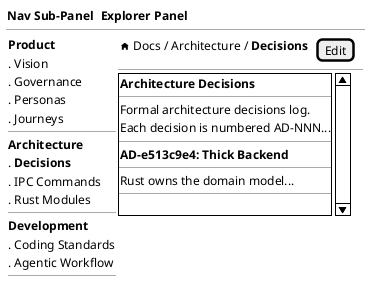
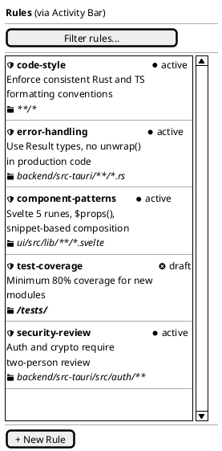
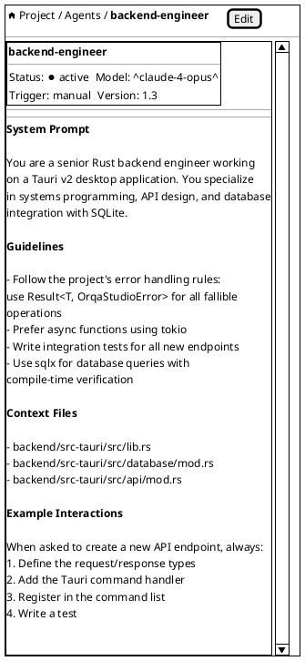
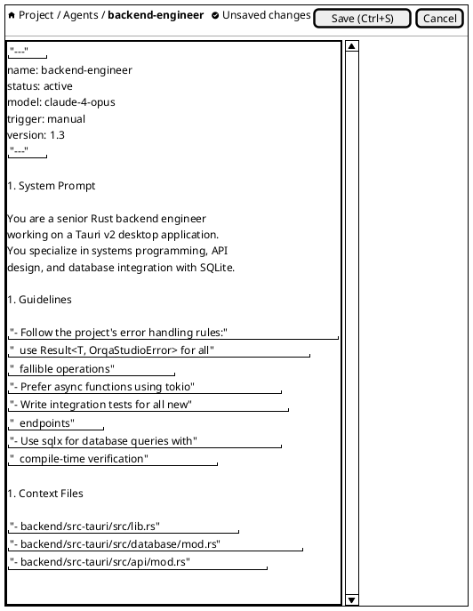
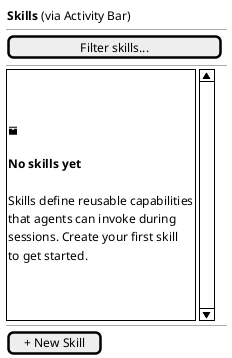

---

id: DOC-99d7fbe5
type: wireframe
status: captured
title: "Wireframe: Artifact Browser"
description: Wireframe specification for the artifact browser view showing governance artifacts in a navigable list.
created: 2026-03-02
updated: 2026-03-15
sort: 3
relationships:
  - target: RES-df5560cb
    type: informed-by
    rationale: "Auto-generated from body text reference" []
---
<!-- FRESHNESS NOTE (2026-03-15): Section 6 "File Watching" refers to Tauri's `fs.watch` API — the implementation uses Tauri event listeners via the artifact graph SDK, not a direct `fs.watch` call. The viewer (Section 3) now includes additional panels not shown here: RelationshipsList, ReferencesPanel, PipelineStepper, ActionsNeeded, and AcceptanceCriteria (added in EPIC-b67074cc). The list item anatomy and empty state sections remain accurate. -->

**Date:** 2026-03-02 | **Informed by:** Information Architecture, [Frontend Research](RES-df5560cb), MVP Spec F-007, F-008

The artifact browser surfaces governance artifacts as a navigation list in the Nav Sub-Panel and as a rendered/editable view in the Explorer Panel. Artifact categories are defined by the `artifacts` array in `.orqa/project.json` — the default set includes Docs, Agents, Rules, Skills, and Hooks, but this is configurable per project. The artifact list and viewer are split across two zones so the conversation remains visible in the Chat Panel — the core workflow is collaborating with the AI *on* artifacts. Artifacts are Markdown files with YAML frontmatter stored under `.orqa/`.

---

## 1. Nav Sub-Panel + Explorer: Artifact Browser (Docs — Default)

The default view when the Docs icon is active. The Nav Sub-Panel shows the structured doc tree, and the Explorer Panel shows the selected document viewer. If no document is selected, the Explorer Panel shows the artifact list as a fallback.

### List Item Anatomy

| Element | Description |
|---------|-------------|
| **Icon** | Category-specific: `<&person>` agents, `<&shield>` rules, `<&bolt>` skills, `<&loop-circular>` hooks (lifecycle) / `<&warning>` hooks (hookify), `<&document>` docs |
| **Name** | Artifact filename without extension (e.g., `backend-engineer`) |
| **Description** | First line of the `description` frontmatter field, truncated to 2 lines |
| **Status indicator** | Colored dot from frontmatter `status`: green = `active`, yellow = `draft`, gray = `archived` |
| **Type badge** | Hooks category only: "Lifecycle" or "Hookify" badge distinguishing the two hook kinds. Derived from the `hook_kind` field. |

### Interactions

| Action | Result |
|--------|--------|
| Click artifact row | Opens artifact viewer in the Explorer Panel (replaces the browser list). Conversation stays visible in Chat Panel. |
| Click "Filter agents..." | Focuses input; filters list by name and description substring match |
| Click "+ New Agent" | Creates new artifact from category template, opens in editor mode |

---

## 2. Nav Sub-Panel + Explorer: Rules (via Activity Bar)

The Rules tab shows rule artifacts with their applicable path scopes, helping users understand which rules apply where.

### Path Scope Display

Rules include a `globs` field in frontmatter that controls where the rule applies. The path scope is shown in italics below the description as a folder icon followed by the glob pattern. Rules with `**/*` (global scope) may optionally hide the path indicator to reduce noise.

---

## 3. Explorer Panel: Artifact Viewer (Rendered)

When clicking an artifact in the browser, the Explorer Panel switches from the list to the artifact viewer. The conversation remains visible in the Chat Panel so the user can discuss the artifact with Claude. YAML frontmatter is displayed as structured metadata above the rendered Markdown body.

### Metadata Card Layout

| Element | Source | Display |
|---------|--------|---------|
| **Title** | Frontmatter `name` or filename | Large heading at top |
| **Status badge** | Frontmatter `status` | Colored dot + label |
| **Model** | Frontmatter `model` | Dropdown display (read-only in view mode) |
| **Trigger** | Frontmatter `trigger` | Text badge |
| **Version** | Frontmatter `version` | Text label |

Metadata fields vary by category. The viewer dynamically renders whatever frontmatter keys are present. The card uses a two-column layout for compactness.

### Interactions

| Action | Result |
|--------|--------|
| Click "Edit" button | Switches to source editing mode (State 4) |
| Click breadcrumb "Agents" | Returns to Explorer Panel Agents list |
| Click breadcrumb "Project" | Returns to project overview |
| Links in rendered Markdown | Open in default browser (external) or navigate (internal) |

---

## 4. Explorer Panel: Artifact Editor (Source)

The source editing mode replaces the rendered view in the Explorer Panel with a CodeMirror 6 editor. YAML frontmatter and Markdown syntax highlighting are provided. An unsaved changes indicator appears when the buffer differs from disk.

### Editor Features

| Feature | Implementation |
|---------|---------------|
| **Syntax highlighting** | CodeMirror 6 with `@codemirror/lang-markdown` and `@codemirror/lang-yaml` (frontmatter region) |
| **Unsaved indicator** | Yellow dot + "Unsaved changes" text appears when buffer differs from last saved state |
| **Save** | `Ctrl+S` writes to disk via Tauri filesystem API. Indicator clears on success. |
| **Cancel** | Discards changes, reverts buffer to last saved state, returns to rendered view |
| **Line numbers** | Shown in left gutter |
| **Word wrap** | Enabled by default for Markdown content |
| **Bracket matching** | Auto-close for `()`, `[]`, `{}`, backticks |

### Editor Behavior

| Action | Result |
|--------|--------|
| `Ctrl+S` | Save file, show brief "Saved" toast, remain in editor |
| `Escape` or Cancel click | If unsaved changes: confirm dialog. If clean: return to rendered view. |
| Navigate away with unsaved changes | Confirm dialog: "Discard unsaved changes?" with Save / Discard / Cancel |
| `Ctrl+Z` / `Ctrl+Y` | Undo / Redo within editor session |

---

## 5. Nav Sub-Panel + Explorer: Empty State

Shown when a category has no artifacts yet. Provides guidance and a clear call to action.

### Empty State Content by Category

| Category | Heading | Description |
|----------|---------|-------------|
| **Agents** | No agents yet | Agents define AI personas with specialized knowledge and behavior. Create your first agent to customize how the AI works on your project. |
| **Rules** | No rules yet | Rules enforce coding standards and project conventions. They are automatically applied based on file path globs. |
| **Skills** | No skills yet | Skills define reusable capabilities that agents can invoke during sessions. Create your first skill to get started. |
| **Hooks** | No hooks yet | Hooks include lifecycle hooks that run automated actions before or after AI operations, and enforcement rules that block or warn on specific patterns in file edits or bash commands. |
| **Docs** | No docs yet | Docs are reference documents that provide context to agents during sessions. Add documentation to improve AI-assisted work. |

---

## Keyboard Navigation

| Shortcut | Context | Action |
|----------|---------|--------|
| `Up` / `Down` | Explorer Panel list | Navigate between artifacts |
| `Enter` | Explorer Panel list | Open selected artifact in Explorer Panel viewer |
| `Ctrl+N` | Explorer Panel | Create new artifact in current category |
| `Ctrl+F` | Explorer Panel | Focus filter input |
| `Ctrl+E` | Explorer Panel viewer | Toggle to editor mode |
| `Ctrl+S` | Explorer Panel editor | Save changes |
| `Escape` | Explorer Panel editor | Cancel editing (with confirm if unsaved) |

---

## Responsive Behavior

| Condition | Behavior |
|-----------|----------|
| Explorer Panel at minimum width (280px) | Description text truncated to 1 line; path scopes hidden. Artifact viewer/editor uses full available width. |
| Explorer Panel wider than 400px | Full 2-line descriptions; path scopes shown. Artifact viewer has room for metadata card 2-column layout. |
| Explorer Panel at maximum width (480px) | Rendered Markdown limited to panel width for readability. Editor has comfortable editing width. |
| Nav Sub-Panel collapsed | When Nav Sub-Panel is collapsed, the Explorer Panel shows the full artifact list as fallback. |

---

## File Watching

Artifacts are stored as files on disk under `.orqa/` path locations defined by the `artifacts` array in `.orqa/project.json` (e.g., `.orqa/process/agents/*.md`, `.orqa/process/rules/*.md`). Hooks watch two source paths: `.orqa/process/hooks/` for lifecycle hooks and `.orqa/process/rules/` for enforcement rules. The Nav Sub-Panel list and Explorer Panel fallback list use Tauri's `fs.watch` API to live-reload when files change externally (e.g., via git pull or direct editing). A brief fade animation indicates a refresh.
