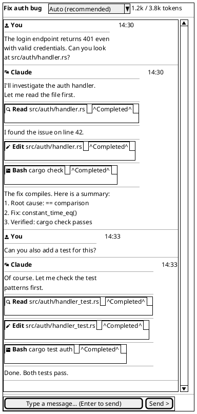
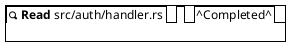
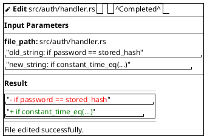
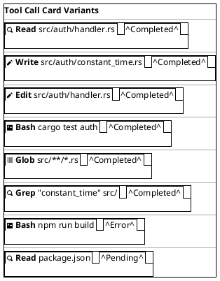
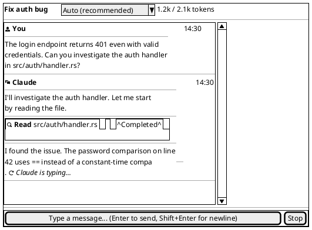
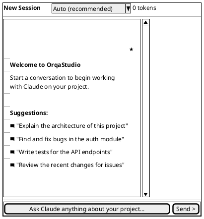
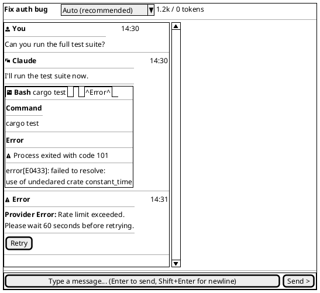

<!-- FRESHNESS NOTE (2026-03-15): The Component Mapping table (Section 5) lists `DiffView.svelte` as a separate component — this does not exist; diff display is handled inline within `ToolCallCard.svelte`. `TypingIndicator.svelte` is implemented as `StreamingIndicator.svelte`. The tool call card status badges for "Approved/Denied/Pending" (post-MVP approval flow) are not yet implemented — only Completed and Error exist. The welcome state heading is "OrqaStudio" not a star icon in current implementation. All other component names and behavior descriptions remain accurate. -->

**Date:** 2026-03-02 | **Informed by:** Information Architecture, [Frontend Research](RES-df5560cb), MVP Spec F-003, F-004

The conversation view is the Chat Panel content. It is where the user interacts with the AI: sending messages, reading streaming responses, and reviewing tool call results. This document covers the active conversation state, streaming mid-response state, and the empty/welcome state.

---

## 1. Active Conversation (Messages + Tool Calls)

A conversation in progress with user messages, assistant responses, and tool call cards in both collapsed and expanded states.

> **Note:** This wireframe shows the high-level conversation layout. See sections 2a/2b below for detailed tool call card anatomy with expanded input parameters and diff views.

### Element Descriptions

#### Session Header

| Element | Behavior |
|---------|----------|
| **Session dropdown** | Clickable session title that opens a dropdown. Dropdown shows: recent sessions list (ordered by most recent), search filter input, "New Session" button. Selecting a session loads it. `Ctrl+N` creates a new session. |
| **Session title** | Editable inline via the dropdown. Click title to open dropdown, double-click to rename. Auto-generated from first user message (first 50 chars) if not manually set. `Escape` cancels editing. `Enter` confirms. |
| **Model selector** | Dropdown showing available models for the configured provider. `Auto (recommended)` is the default when the provider supports it — it delegates model choice to the provider based on current rate limits and availability. If the provider does not support auto, the option is hidden and a specific model is required. Model options are populated from the active provider's capabilities. Changing model takes effect on the next message sent. Does not affect previous messages. |
| **Token usage** | Format: `{input tokens} / {output tokens} tokens`. Updated after each complete message exchange. Sourced from sidecar usage reporting. |

#### Message Stream

| Element | Behavior |
|---------|----------|
| **User message** | Prefixed with `person` icon and **You** role label. Timestamp on the right. Plain text or markdown content. |
| **Assistant message** | Prefixed with `chat` icon and **Claude** role label. Timestamp on the right. Content rendered as markdown via `@humanspeak/svelte-markdown`. |
| **Timestamp** | Relative format for today ("14:30"), date format for older ("Mar 1, 14:30"). Hover shows full ISO timestamp in a tooltip. |
| **Auto-scroll** | Conversation auto-scrolls to bottom on new content. If user scrolls up (more than 100px from bottom), auto-scroll pauses. A "Scroll to bottom" floating button appears. Clicking it resumes auto-scroll. |
| **Message gap** | 16px vertical gap between messages. 8px gap between content blocks within a message. |

#### Code Blocks

| Element | Behavior |
|---------|----------|
| **Language label** | Shown in the top-left corner of the code block (e.g., `rust`, `typescript`). Detected from the fenced code block language tag. |
| **Copy button** | Top-right corner of the code block. Click copies the code content to clipboard. Icon changes from clipboard to checkmark for 2 seconds after copy. Uses `navigator.clipboard.writeText()`. |
| **Syntax highlighting** | Powered by `svelte-highlight` (highlight.js) for streaming/dynamic content. Monospace font (`JetBrains Mono` or system monospace). Dark background regardless of theme. |
| **Horizontal scroll** | Code blocks scroll horizontally if lines exceed the container width. No word-wrap. |

---

## 2. Tool Call Cards (Collapsed vs. Expanded)

Detail view showing the two states of tool call cards.

### 2a. Collapsed Tool Call (Default)

### 2b. Expanded Tool Call (Click to Expand)

### 2c. All Tool Card Variants

### Tool Call Card Descriptions

| Element | Behavior |
|---------|----------|
| **Tool icon** | Varies by tool type. `magnifying-glass` for Read/Grep, `pencil` for Write/Edit, `terminal` for Bash, `list` for Glob. |
| **Tool name** | Bold label: Read, Write, Edit, Bash, Glob, Grep. |
| **Input summary** | Truncated to one line. For file tools: the file path. For Bash: the command. For Grep: the pattern + path. For Glob: the pattern. |
| **Status badge** | Badge component with color coding. **Completed** (green): tool finished successfully. **Error** (red): tool returned an error. **Pending** (yellow): tool call awaiting execution (post-MVP approval flow). **Approved** (blue): approved by user, executing (post-MVP). **Denied** (gray): user denied the tool call (post-MVP). MVP only shows Completed and Error. |
| **Collapse toggle** | Click anywhere on the summary row to toggle expand/collapse. Chevron icon rotates. Uses shadcn-svelte `Collapsible` component. |
| **Expanded: Input** | Full input parameters displayed as key-value pairs. Monospace for code values. |
| **Expanded: Result** | Full output. For Edit/Write: diff view with red deletions, green additions. For Bash: monospace command output. For Read: file contents (truncated with "Show more" if > 50 lines). For Glob/Grep: list of matching files/lines. |
| **Error styling** | Error badge is red. Expanded error result has a red-tinted background with the error message. |

---

## 3. Streaming State (Mid-Response)

What the conversation looks like while Claude is actively generating a response. The assistant message is incomplete and tokens are appearing in real-time.

### Streaming State Descriptions

| Element | Behavior |
|---------|----------|
| **Partial text** | Text appears character by character (or in small chunks) as tokens arrive from the sidecar via `Channel<T>`. The pipe character `\|` represents the blinking cursor at the insertion point. |
| **Typing indicator** | Below the partial text: a spinner icon + "Claude is typing..." in italic. Animates while tokens are arriving. Disappears when the message is complete. |
| **Token counter** | The token usage indicator in the header updates in real-time as tokens stream in. Shows running total. |
| **Send / Stop button** | The Send button changes to a **Stop** button (red-tinted) during streaming. Clicking Stop sends an abort signal to the sidecar, which cancels the current generation. The partial response is preserved as-is. |
| **Input area** | Still editable during streaming (user can prepare next message), but pressing Enter is disabled while streaming is active. The placeholder text remains visible. |
| **Auto-scroll** | Active by default during streaming. Each new token chunk triggers a scroll-to-bottom. If the user scrolls up, a "Scroll to bottom" pill appears at the bottom of the message stream. |
| **Markdown rendering** | Partial markdown is rendered progressively. Incomplete markdown constructs (e.g., an unclosed bold `**word`) are rendered as plain text until the construct is closed. Code blocks render with syntax highlighting once the closing fence is detected. |
| **Tool call during stream** | Tool calls can appear mid-stream. They render as collapsed cards immediately. If a tool is still executing, its badge shows a spinner instead of a status. The text stream pauses while a tool executes, then resumes after the tool result returns. |

---

## 4. Empty / Welcome State

The conversation view when no session is active or when a new empty session has been created.

### Empty State Descriptions

| Element | Behavior |
|---------|----------|
| **Session title** | Defaults to "New Session". Becomes auto-titled after the first user message is sent (first 50 characters of the message). |
| **Token counter** | Shows "0 tokens" until the first exchange. |
| **Welcome icon** | A centered star or OrqaStudio™ logo icon. Visually anchors the empty state. |
| **Welcome heading** | "Welcome to OrqaStudio" in bold. |
| **Welcome subtitle** | Brief guidance text: "Start a conversation to begin working on your project." |
| **Suggestion prompts** | 3-4 clickable suggestions relevant to common workflows. Each is a `comment-square` icon + quoted text. Clicking a suggestion inserts it into the input area and focuses the input (does not auto-send). Suggestions are context-aware: if project metadata is available (detected languages, frameworks), suggestions reference the actual project. |
| **Input placeholder** | "Ask about your project..." -- slightly different from the active session placeholder to reinforce the starting context. |
| **Model selector** | Defaults to "Auto (recommended)" when the provider supports it, otherwise the user's last-used model. Changeable before sending the first message. When Auto is active, the status bar shows the resolved model once streaming begins. |

---

## 5. Error States

How errors appear within the conversation stream.

### Error State Descriptions

| Element | Behavior |
|---------|----------|
| **Tool error** | Tool call card with red "Error" badge. Expanded view shows the error output with a warning icon and red-tinted background. The assistant message continues after the error (Claude can react to the error). |
| **Provider error** | Rendered as a distinct error block in the message stream. Warning icon + "Error" role label. Shows error type (rate limit, auth failure, network error, etc.) and a human-readable message. |
| **Retry button** | Appears on provider errors. Clicking retries the last user message. Only shown for transient errors (rate limits, timeouts). Not shown for permanent errors (auth failures). |
| **Sidecar disconnect** | If the sidecar connection drops mid-conversation, an error block appears: "Connection to Claude lost. Reconnecting..." with a spinner. If reconnection fails after 3 attempts: "Connection failed. Check status bar for details." with a "Reconnect" button. |

---

## Component Mapping

How wireframe elements map to implementation components and libraries.

| Wireframe Element | Svelte Component | Library / Primitive |
|-------------------|-----------------|-------------------|
| Session header | `ConversationHeader.svelte` | shadcn-svelte `Select` (model dropdown), custom editable title |
| Message stream | `MessageStream.svelte` | shadcn-svelte `ScrollArea`, virtual list for long sessions |
| User message | `UserMessage.svelte` | `@humanspeak/svelte-markdown` for content |
| Assistant message | `AssistantMessage.svelte` | `@humanspeak/svelte-markdown` for content |
| Tool call card | `ToolCallCard.svelte` | shadcn-svelte `Collapsible`, `Badge` |
| Code block | `CodeBlock.svelte` | `svelte-highlight` (highlight.js), shadcn-svelte `Button` (copy) |
| Diff view | `DiffView.svelte` | Custom component, monospace with color-coded lines |
| Streaming cursor | `StreamingCursor.svelte` | CSS animation (blinking pipe), Svelte 5 `$state` |
| Typing indicator | `TypingIndicator.svelte` | `lucide-svelte` Loader icon + text |
| Input area | `MessageInput.svelte` | shadcn-svelte `Textarea`, `Button` |
| Welcome state | `WelcomeState.svelte` | `lucide-svelte` icons, shadcn-svelte `Button` for suggestions |
| Error block | `ErrorBlock.svelte` | shadcn-svelte `Alert`, `Button` (retry) |
| Token counter | `TokenUsage.svelte` | Plain text, updated via `$state` |

---

## Keyboard Shortcuts (Conversation-Specific)

| Shortcut | Action |
|----------|--------|
| `Enter` | Send message (when input is focused) |
| `Shift+Enter` | Insert newline in input |
| `Escape` | Cancel streaming (same as clicking Stop) |
| `Ctrl+Shift+C` | Copy last code block to clipboard |
| `Home` | Scroll to top of conversation |
| `End` | Scroll to bottom of conversation |
| `Page Up` / `Page Down` | Scroll conversation by viewport height |

---

## Responsive Behavior

| Condition | Behavior |
|-----------|----------|
| **Nav Sub-Panel collapsed** | Chat Panel expands. Message lines wrap at wider widths. Code blocks gain more horizontal room. |
| **Wide window (all zones open)** | Chat Panel shares space with Explorer. Comfortable conversation width. |
| **Narrow window (< 720px)** | Chat becomes overlay Sheet. Explorer fills window as focal point. |
| **Minimum window (900x600)** | Chat Panel at min-width 360px. Messages wrap aggressively. Code blocks show horizontal scrollbar. Tool call cards stack their summary elements. Input area remains full-width at bottom. |

---

## Scroll Behavior Details

| Scenario | Behavior |
|----------|----------|
| **New message arrives, user at bottom** | Auto-scroll to show new content. |
| **New message arrives, user scrolled up** | No auto-scroll. "Scroll to bottom" pill appears as a floating button above the input area. Badge shows count of new messages below. |
| **User clicks "Scroll to bottom"** | Smooth scroll to bottom. Re-enables auto-scroll. Pill disappears. |
| **Streaming in progress, user at bottom** | Auto-scroll continuously as tokens arrive (debounced to 60fps). |
| **Streaming in progress, user scrolls up** | Auto-scroll pauses. "Scroll to bottom" pill appears. Streaming continues in background. |
| **Session loaded from history** | Scrolls to the bottom of the loaded session (most recent messages). |

---

## Related Documents

- Core Layout Wireframe -- Three-zone + nav sub-panel structure that contains this view
- Information Architecture -- Chat Panel: Conversation View specification
- [Frontend Research Q1](RES-df5560cb) -- Markdown rendering and code highlighting decisions
- [Frontend Research Q2](RES-df5560cb) -- Conversation UI component architecture
- MVP Spec F-003 -- Conversation Streaming acceptance criteria
- MVP Spec F-004 -- Tool Call Display acceptance criteria
- MVP Spec F-005 -- Session Persistence (affects session header)
