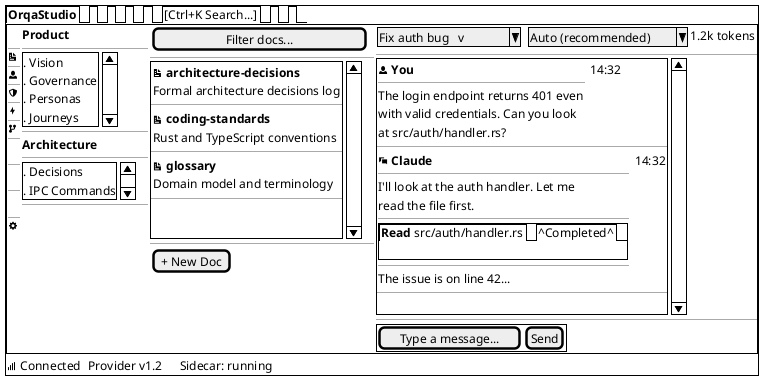
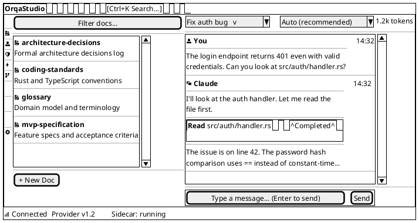
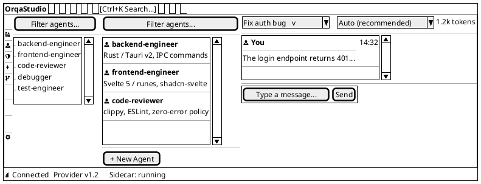
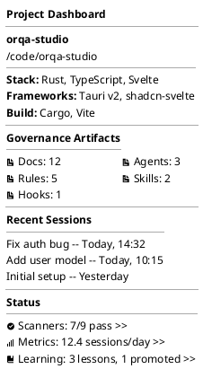

---

id: DOC-91c7dc26
type: wireframe
status: captured
title: "Wireframe: Core Layout"
description: "Wireframe specification for the core application layout with sidebar, panels, and toolbar."
created: 2026-03-02
updated: 2026-03-15
sort: 1
relationships:
  - target: RES-df5560cb
    type: informed-by
    rationale: "Auto-generated from body text reference" []
  - target: AD-4f5277f0
    type: informed-by
    rationale: "Auto-generated from body text reference"
---
<!-- FRESHNESS NOTE (2026-03-15): The "Zone Relationship to PaneForge" section is stale — the implementation uses shadcn-svelte Resizable (PaneGroup/Pane/Handle) not PaneForge. The three-zone structure, Activity Bar, Nav Sub-Panel, and Status Bar descriptions remain accurate. The Project Dashboard section in the wireframe (shown as a wireframe view) reflects an earlier vision — the actual dashboard is now the narrative flow layout (see EPIC-11561c51 and the dashboard wireframe). -->

**Date:** 2026-03-02 | **Informed by:** Information Architecture, [Frontend Research](RES-df5560cb), Design System

The main window structure showing all zones: Activity Bar, Nav Sub-Panel, Explorer Panel, and Chat Panel, plus Toolbar and Status Bar. This replaces the previous four-zone layout with a three-zone + nav sub-panel design [AD-4f5277f0](AD-4f5277f0).

---

## Default State (All Zones Open)

### Zone Dimensions

| Zone | Default | Min | Max | Collapsible |
|------|---------|-----|-----|-------------|
| Activity Bar | 48px (fixed) | 48px | 48px | No |
| Nav Sub-Panel | 200px | 160px | 280px | Yes (collapse to 0px) |
| Explorer Panel | Flex (fills remaining) | 280px | — | No |
| Chat Panel | Flex (fills remaining) | 360px | — | No |
| Toolbar | Full width | — | — | No |
| Status Bar | Full width | — | — | No |

Nav Sub-Panel, Explorer, and Chat share remaining horizontal space after the Activity Bar (48px). When the Nav Sub-Panel is collapsed, its space redistributes to Explorer and Chat.

### Zone Relationship to PaneForge

The Activity Bar sits **outside** PaneForge as a fixed-width CSS flex element (48px). PaneForge manages the three resizable zones: Nav Sub-Panel | Explorer Panel | Chat Panel.

---

## Nav Sub-Panel Collapsed State

When the Nav Sub-Panel is collapsed via `Ctrl+B`, its space redistributes to the Explorer and Chat panels.

---

## Activity Bar: Agents Selected

When the user clicks the Agents icon in the Activity Bar, the Explorer Panel switches to show the Agents artifact list.

---

## Project Dashboard View

When the user clicks the Project Dashboard icon (top of Activity Bar), the Explorer Panel shows the project overview. The Nav Sub-Panel is hidden for this view.

---

## Element Descriptions

### Toolbar

| Element | Behavior |
|---------|----------|
| **Project name** ("OrqaStudio™") | Click opens project switcher dropdown. Shows current project name. |
| **Search** | `Ctrl+K` focuses. FTS5-powered search across sessions and artifacts. Results appear in Explorer Panel. |

Note: The settings gear is removed from the toolbar. Settings is now accessible via the Activity Bar (bottom icon) or `Ctrl+,`. New sessions are created via `Ctrl+N` or the session dropdown in the Chat Panel header.

### Activity Bar

| Element | Behavior |
|---------|----------|
| **Project Dashboard icon** | Top of Activity Bar. Click switches Explorer Panel to project dashboard. Nav Sub-Panel hidden. `Ctrl+0`. |
| **Artifact category icons** | Artifact categories are defined by the `artifacts` array in `.orqa/project.json` (default: Docs, Agents, Rules, Skills, Hooks). Click switches the Explorer Panel to that category's artifact list. Active icon has a 2px left border indicator + highlighted background. The Hooks icon surfaces both lifecycle hooks (`.orqa/process/hooks/`) and enforcement rules (`.orqa/process/rules/`). |
| **Dashboard icons** | Scanners, Metrics, Learning (post-MVP). Click switches the Explorer Panel to the corresponding dashboard. |
| **Settings icon** | Bottom-aligned. Click switches the Explorer Panel to the settings view. `Ctrl+,`. |
| **Tooltips** | Each icon shows a tooltip on hover with the zone name and keyboard shortcut. |
| **Keyboard shortcuts** | `Ctrl+0` for Project Dashboard. `Ctrl+1` through `Ctrl+5` for artifact categories. `Ctrl+,` for settings. |

### Status Bar

| Element | Behavior |
|---------|----------|
| **Connection indicator** | Green dot = connected. Red dot = disconnected. Click to view connection details. |
| **Provider version** | Shows the detected provider version. |
| **Sidecar status** | "running", "idle", "error". Shows current sidecar process state. |

### Resize Handles

PaneForge provides drag handles between the Nav Sub-Panel, Explorer, and Chat panes. Handles are 1px borders with an 8px invisible drag target. Double-click a handle to collapse/expand the Nav Sub-Panel.

---

## Keyboard Navigation

| Shortcut | Action |
|----------|--------|
| `Ctrl+0` | Project Dashboard |
| `Ctrl+1` through `Ctrl+5` | Switch artifact category |
| `Ctrl+B` | Toggle Nav Sub-Panel |
| `Ctrl+K` | Focus global search |
| `Ctrl+N` | New session |
| `Ctrl+,` | Open settings in Explorer Panel |
| `Tab` | Move focus between zones (Activity Bar > Nav Sub-Panel > Explorer > Chat) |
