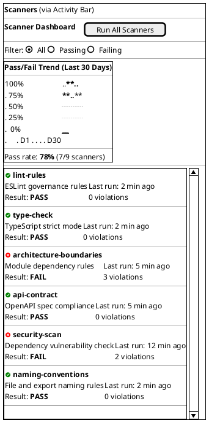
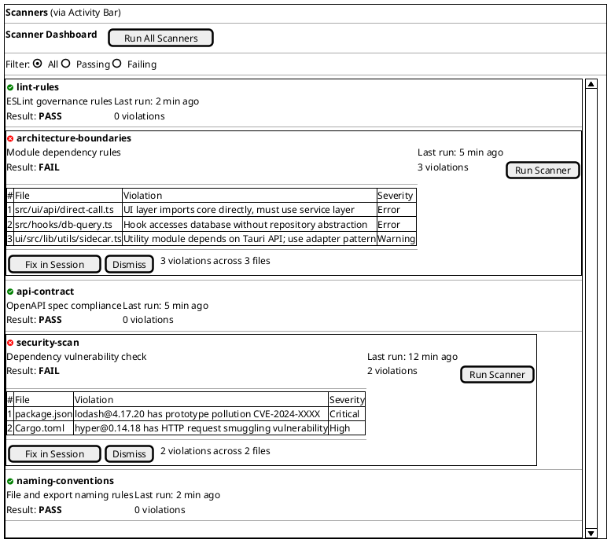
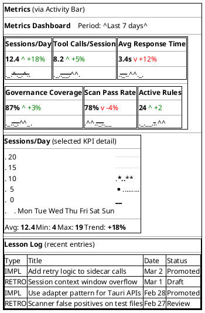
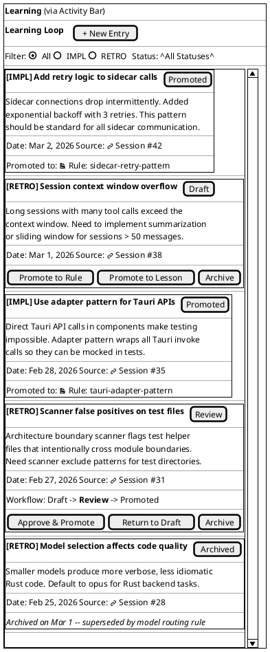

<!-- FRESHNESS NOTE (2026-03-15): This wireframe is significantly outdated. The Scanner Dashboard, Metrics Dashboard, and Learning Loop views shown here were the original design vision but were never built as described. The implemented dashboard (EPIC-11561c51) uses a narrative flow layout with pillar-aligned columns: MilestoneContextCard, IntegrityWidget, PipelineWidget, GraphHealthWidget, LessonVelocityWidget, DecisionQueueWidget, and ImprovementTrendsWidget. The scanner dashboard and metrics KPI cards do not exist as standalone Explorer Panel views — their data surfaces as widgets on the unified dashboard. The learning loop view corresponds to the artifact browser's Lessons category, not a separate dashboard. This wireframe should be rewritten to reflect the current dashboard architecture if it is to remain authoritative. -->


**Date:** 2026-03-02 | **Informed by:** Information Architecture, [Frontend Research](RES-df5560cb)

Dashboard views appear in the Explorer Panel and provide operational visibility into scanning, metrics, and the learning loop. These are post-MVP features designed early to validate the information architecture and panel system.

> **Note:** These wireframes represent future features (Scanner Dashboard, Metrics Dashboard, Learning Loop). They are designed now to ensure the panel system and data model accommodate these views without rework.

### How to Navigate to Dashboards

Dashboard views are Explorer Panel views, accessed the same way as the artifact browser or settings:

| Entry Point | Action |
|-------------|--------|
| **Activity Bar icons** | Scanners, Metrics, and Learning icons in the Activity Bar switch the Explorer Panel to the corresponding dashboard view. |
| **Project Dashboard** | Scanner status, metrics, and learning summaries on the Project Dashboard are clickable links that activate the corresponding Activity Bar icon. |
| **Activity Bar** | Click the Scanners, Metrics, or Learning icons in the Activity Bar. |

All dashboards share the Explorer Panel — switching to a dashboard replaces the current Explorer view. The conversation always remains visible in the Chat Panel.

---


## 1. Scanner Dashboard (Mixed Pass/Fail Results)

The scanner dashboard shows all configured scanners with their current status, accessible via the Scanners icon in the Activity Bar.



### Scanner List Elements

| Element | Behavior |
|---------|----------|
| **Status icon** | Green check for pass, red X for fail. |
| **Scanner name** | Click to expand violation details (see wireframe 2). |
| **Description** | Brief summary of what the scanner checks. |
| **Last run** | Relative timestamp of last execution. |
| **Result** | PASS/FAIL badge with violation count. |
| **Run All Scanners** | Triggers all scanners. Individual scanners run via their expanded view. |
| **Filter radio buttons** | All shows every scanner; Passing/Failing filters the list. |
| **Trend chart** | LayerChart area chart showing pass rate over last 30 days. |

---


## 2. Scanner Dashboard -- Violation Detail Expanded

When a failing scanner row is clicked, it expands to show individual violations with file locations and descriptions.



### Violation Detail Elements

| Element | Behavior |
|---------|----------|
| **Violation table** | Sortable columns. Click file path to open in editor. |
| **Severity** | Critical, Error, Warning. Color-coded. |
| **Fix in Session** | Creates a new session pre-filled with scanner violations as context for AI-assisted fixing. |
| **Dismiss** | Collapses the violation detail back to the summary row. |
| **Run Scanner** | Re-runs just this individual scanner. |

---


## 3. Metrics Dashboard with KPI Cards and Chart

The metrics dashboard provides operational KPIs with trend indicators and sparklines, plus a detailed time-series chart area.



### KPI Card Elements

| Element | Behavior |
|---------|----------|
| **Card title** | Metric name. Click to load detailed chart below. |
| **Current value** | Large numeric display of the current/average value. |
| **Trend indicator** | Up arrow (green) = improving, down arrow (red) = degrading. Percentage or absolute change. |
| **Sparkline** | Miniature inline trend line rendered by LayerChart. Shows last 7 data points. |
| **Detail chart** | Full-width LayerChart time-series for the selected KPI. Appears below the card grid. |
| **Period selector** | Dropdown: Last 7 days, Last 30 days, Last 90 days, All time. |

### Lesson Log Elements

| Element | Behavior |
|---------|----------|
| **Type column** | IMPL (implementation lesson) or RETRO (retrospective insight). |
| **Title** | Click to open the full lesson entry in the Explorer Panel. |
| **Status** | Draft, Review, Promoted, Archived. |
| **Promoted entries** | Promoted lessons have been converted into active rules or agent instructions. |

---


## 4. Learning Loop -- IMPL/RETRO Cards

The learning loop view manages implementation lessons and retrospective insights, with a promotion workflow for converting them into governance artifacts.



### Promotion Workflow

```
Draft --> Review --> Promoted
  |                    |
  +---> Archived <-----+
```

| Stage | Description |
|-------|-------------|
| **Draft** | Initial entry captured from a session. Author can edit freely. |
| **Review** | Submitted for review. Shows approval/rejection actions. |
| **Promoted** | Converted into a governance artifact (rule, agent instruction, or lesson). Links to the created artifact. |
| **Archived** | No longer active. Retained for historical reference. Can be restored to Draft. |

### Learning Loop Card Elements

| Element | Behavior |
|---------|----------|
| **Type badge** | [IMPL] or [RETRO] -- color-coded (blue for IMPL, orange for RETRO). |
| **Title** | Bold text. Click to expand/collapse card body. |
| **Status badge** | Draft (gray), Review (yellow), Promoted (green), Archived (muted). |
| **Description** | Free-text body of the lesson or retrospective. Markdown supported. |
| **Source link** | Links back to the originating session. Opens in the Chat Panel. |
| **Promote to Rule** | Creates a new rule artifact pre-filled from the lesson content. |
| **Promote to Lesson** | Promotes as a general lesson referenced by agents. |
| **Archive** | Moves entry to archived status. |
| **Promoted to** | Read-only link to the governance artifact created from this entry. |
| **New Entry** | Opens a form to create a new IMPL or RETRO entry manually. |

---


## Keyboard Navigation

| Shortcut | Action |
|----------|--------|
| Activity Bar icon click | Open corresponding dashboard in Explorer Panel |
| `Up/Down` | Navigate between scanner rows or learning cards |
| `Enter` | Expand selected scanner or card |
| `Escape` | Collapse expanded detail |
