<!-- FRESHNESS NOTE (2026-03-15): The onboarding wizard (Sections 2-5) is partially outdated. The actual SetupWizard has more steps than the wireframe shows: ClaudeCliStep, ClaudeAuthStep, SidecarStep, EmbeddingModelStep, and SetupComplete — the wireframe only shows CLI setup and project selection. The "Project Discovery conversation" flow (Sections 5a/5b) and governance artifact confirmation dialog (5c) are not yet implemented. The Settings view (Section 1) is largely accurate — Provider, Project, Appearance, and Shortcuts sections all exist. Settings now lives in a `SettingsView` component rendered in the Explorer Panel, matching the wireframe. The "Model" settings section is not shown in the wireframe but exists in the implementation. -->

**Date:** 2026-03-02 | **Informed by:** [Onboarding Research](RES-3b36e149), MVP Spec F-001, F-001b, F-009

Settings appears in the Explorer Panel when the user clicks the Settings icon in the Activity Bar (bottom) or presses `Ctrl+,`. Onboarding flows are full-window overlays shown on first run or when no project is loaded.

---

## 1. Settings in Explorer Panel (All Sections)

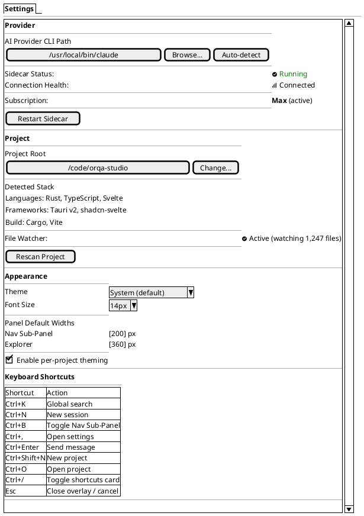

### Settings Section Behavior

| Section | Notes |
|---------|-------|
| **Provider** | CLI path can be typed, browsed via native file dialog, or auto-detected. Auto-detect searches PATH and common install locations. Sidecar status updates in real time. |
| **Project** | Project settings are stored in `.orqa/project.json` (file-based, source of truth). When no settings file exists, shows a setup wizard with scan + save flow. When settings file exists, shows an editable form (name, description, model, excluded paths, detected stack, governance counts). Rescan re-detects stack and governance artifacts. Changes save on blur — no manual save button. |
| **Appearance** | Theme dropdown offers Light, Dark, System. Font size dropdown ranges 12px--20px. Panel widths accept numeric input with min/max validation. |
| **Keyboard Shortcuts** | Read-only reference card. All shortcuts are global (not remappable in MVP). |

---

## 2. First-Run Welcome Screen (No Project, No API Key)

Full-window overlay. No panels -- just the centered welcome content.

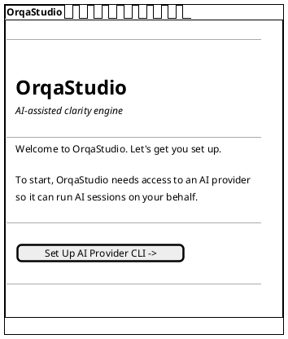

### Welcome Screen Behavior

| Element | Notes |
|---------|-------|
| **Anvil mark** | Rendered above the title in the actual UI; Salt cannot depict graphical logos. |
| **Set Up AI Provider CLI** | Primary action button, advances to the CLI setup step (State 3). |
| **No wizard steps** | There is no numbered step indicator. Progression is linear but presented as self-contained screens, consistent with conversation-first progressive disclosure. |

---

## 3. API Key / CLI Setup Step

Still a full-window overlay. The user provides the AI Provider CLI path.

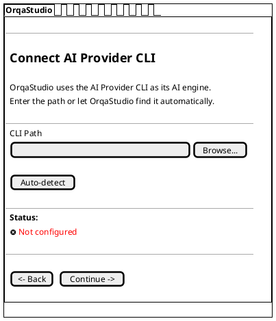

### CLI Setup -- After Successful Detection

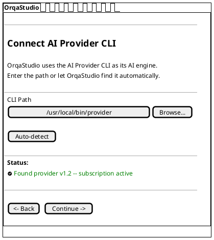

### CLI Setup States

| State | Status Indicator | Continue Button |
|-------|-----------------|-----------------|
| Not configured | Red X -- "Not configured" | Disabled |
| Detecting... | Spinner -- "Searching..." | Disabled |
| Found | Green check -- version and subscription info | Enabled |
| Error | Red X -- "Not found at path" or "CLI returned error" | Disabled |

---

## 4. Project Open with Scan Results

After CLI setup, the user selects a project folder. This screen shows the scan results and invites the user into the main workspace.

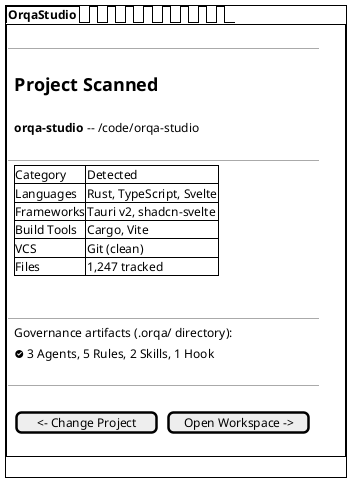

### Project Selection -- Preceding Step

Before the scan results appear, the user sees a project selection screen.

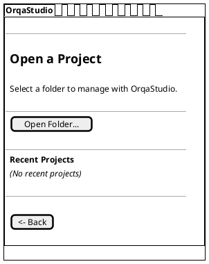

### Project Selection -- With Recent Projects (Return Visit)

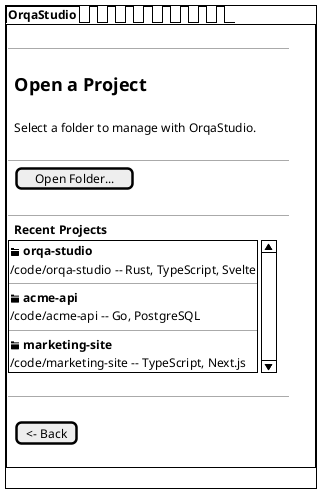

---

## 5a. New Project -- Discovery Prompt

When the user opens a folder that has no `.orqa/` directory (or creates a new project), OrqaStudio™ offers to start a project discovery conversation instead of just scaffolding generic files.

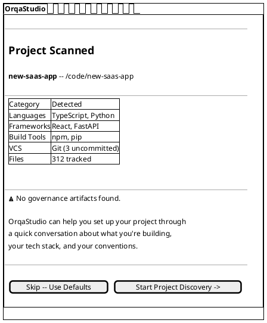

### Discovery Prompt -- Empty Project Variant

For a truly new project with no code detected, the scan table is replaced with a brief message.

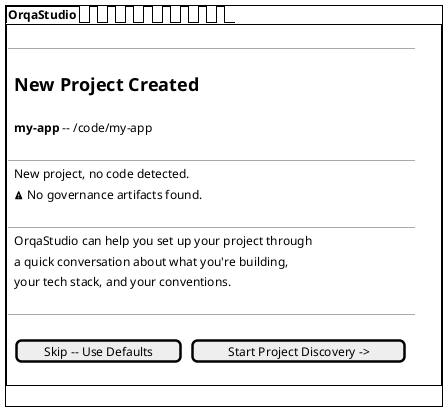

### Discovery Prompt Behavior

| Element | Notes |
|---------|-------|
| **Scan results table** | Shown for existing-code projects. Hidden for truly empty new projects. |
| **Start Project Discovery** | Primary action. Opens the main workspace with a discovery conversation session already in progress. |
| **Skip -- Use Defaults** | Secondary action. Creates a minimal `.orqa/project.json` (project name + date), empty governance directories, and opens the workspace with a blank conversation. |
| **No file list** | Unlike the old scaffold prompt, no specific files are listed — the discovery conversation determines what gets created. |

---

## 5b. New Project -- Discovery Conversation

After the user clicks "Start Project Discovery", OrqaStudio opens the main three-zone workspace with a discovery conversation already in progress. This is a regular conversation session — the discovery behavior comes from the system prompt, not special UI.

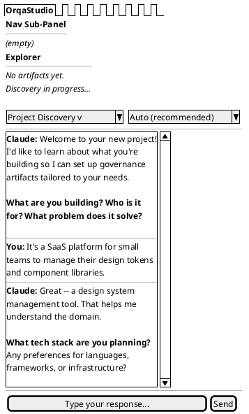

### Discovery Conversation Behavior

| Element | Notes |
|---------|-------|
| **Session dropdown** | The discovery session appears as "Project Discovery" in the session dropdown — a regular session, not a special mode. |
| **Conversation** | The AI follows a system prompt that covers product, tech stack, team, conventions, and prior art. The user responds naturally. |
| **Explorer Panel** | Empty during discovery. Populates after the user approves generated artifacts. |
| **Exit anytime** | The user can close the conversation, start a new session, or say "that's enough." The discovery session persists and can be resumed. |
| **No special UI** | This is the standard three-zone layout. The discovery "magic" is entirely in the system prompt — no wizard, no special components. |

---

## 5c. New Project -- Governance Artifacts Confirmation

After discovery (or when the AI has gathered enough context), it proposes artifacts. The user reviews them in a confirmation dialog before any files are written.

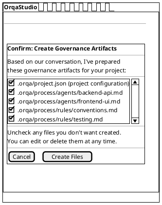

---

## Settings in Explorer Panel -- Sidecar Error State

When the sidecar process encounters an error, the Provider section surfaces the problem.

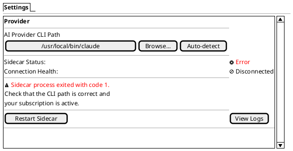

---

## Settings in Explorer Panel -- Idle Sidecar State

When no session is active, the sidecar is idle.

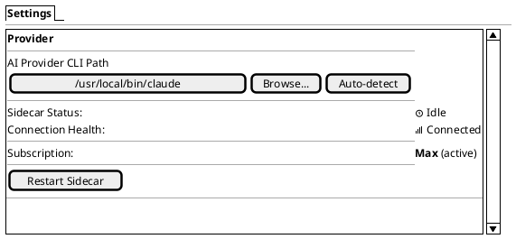

---

## Onboarding Flow Diagram

The overall onboarding progression, for reference.

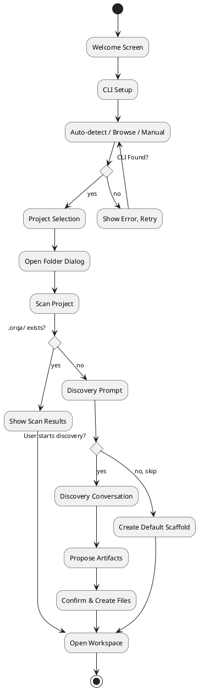

---

## Element Descriptions

### Onboarding Screens

| Screen | Purpose | Exit Condition |
|--------|---------|----------------|
| **Welcome** | Brand introduction, single CTA to begin setup. | User clicks "Set Up AI Provider CLI". |
| **CLI Setup** | Configure the AI Provider CLI path. Auto-detect available. | Valid CLI detected and verified. |
| **Project Selection** | Pick a folder. Recent projects shown on return visits. | Folder selected via native dialog or recent list. |
| **Scan Results** | Display detected stack, file count, existing artifacts. For projects with existing `.orqa/`. | User clicks "Open Workspace" or "Change Project". |
| **Discovery Prompt** | Offer project discovery conversation for projects without `.orqa/`. Explains that OrqaStudio can learn about the project through conversation. | User clicks "Start Project Discovery" or "Skip -- Use Defaults". |
| **Discovery Conversation** | A regular conversation session in the main workspace where the AI asks about product, tech stack, team, and conventions. Not a special UI mode. | User completes discovery or says "that's enough". The AI proposes artifacts. |
| **Governance Confirmation** | Review proposed governance artifacts (from discovery or defaults) before writing to disk. User can uncheck individual files. | User confirms or cancels. |

### Settings Sections

| Section | Persisted To | Scope |
|---------|-------------|-------|
| **Provider** | App-level config (SQLite) | Global |
| **Project** | `.orqa/project.json` (file-based, per-project) | Project |
| **Appearance** | App-level config; per-project override if toggle enabled | Global / Project |
| **Keyboard Shortcuts** | Read-only in MVP | Global |

### State Indicators

| Indicator | Icon | Color | Meaning |
|-----------|------|-------|---------|
| Sidecar running | `<&circle-check>` | Green | Process alive, accepting commands |
| Sidecar idle | `<&clock>` | Neutral | Process alive, no active session |
| Sidecar error | `<&circle-x>` | Red | Process exited or unreachable |
| Connected | `<&signal>` | Green | IPC channel healthy |
| Disconnected | `<&ban>` | Red | IPC channel broken |

---

## Keyboard Navigation

| Shortcut | Action |
|----------|--------|
| `Ctrl+,` | Open settings in Explorer Panel |
| `Ctrl+O` | Open project (shows folder dialog) |
| `Ctrl+Shift+N` | New project (onboarding flow from project selection) |
| `Esc` | Close onboarding overlay / return to workspace |
| `Tab` | Move focus between form fields within settings |
| `Enter` | Activate focused button |
