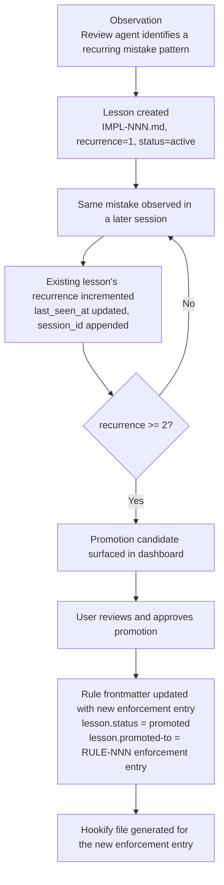

**Date:** 2026-03-05

The lesson promotion pipeline captures implementation mistakes, tracks their recurrence across sessions, and promotes recurring patterns into enforceable governance artifacts. Lessons are individual markdown files with YAML frontmatter. SQLite caches metadata for fast queries and dashboard display. Promoted lessons become enforcement entries in rule files.

---


## Storage: `.orqa/process/lessons/`

Lessons are stored as individual markdown files in `.orqa/process/lessons/` within the project root. Each file holds a single lesson with YAML frontmatter for machine-readable metadata and a markdown body for human-readable content.

This location is intentional: `.orqa/` is the project-specific directory for OrqaStudio™ metadata. CLI compatibility layers (such as `.claude/`) may symlink into `.orqa/` but `.orqa/` is the authoritative source of truth.

### File Naming

`<IMPL-NNN>.md` — lesson identifier matches the IMPL number displayed in the UI.

Example: `.orqa/process/lessons/[IMPL-eb748de2](IMPL-eb748de2).md`

### YAML Frontmatter Schema

```yaml
---

id: IMPL-eb748de2
title: "Brief title describing the mistake"
tags:
  - tauri
  - error-handling
recurrence: 3
status: active | promoted | archived
promoted-to: null | "RULE-NNN enforcement entry RULE-NNN-001"
created_at: "2026-03-05T14:30:00Z"
last_seen_at: "2026-03-10T09:15:00Z"
session_ids:
  - "session-uuid-1"
  - "session-uuid-2"
  - "session-uuid-3"
---

```

**Fields:**

| Field | Type | Description |
|-------|------|-------------|
| `id` | string | Unique identifier. Format: `IMPL-NNN` (zero-padded, three digits). |
| `title` | string | Concise description of the lesson. Shown in navigation lists. |
| `category` | string | Technology or domain category for filtering. |
| `tags` | string[] | Freeform tags for search and discoverability. |
| `recurrence` | integer | How many times this mistake has been observed. Starts at 1 on creation. Incremented each time the pattern recurs. |
| `status` | string | `active`: tracked but not yet promoted. `promoted`: converted to a rule enforcement entry. `archived`: no longer relevant. |
| `evolves-into` | string or null | When promoted, references the rule ID and entry ID. Null until promoted. |
| `created_at` | ISO 8601 | When the lesson was first recorded. |
| `last_seen_at` | ISO 8601 | When the lesson was most recently observed. |
| `session_ids` | string[] | Session IDs where this lesson was observed. Used for traceability. |

### Markdown Body

The markdown body follows this structure:

```markdown
## What Happened

[Description of the mistake as it occurred in a specific session]

## Why It Recurs

[Root cause analysis — why agents tend to make this mistake]

## Correct Approach

[The right way to handle this situation, with code examples if applicable]

## Detection

[How to recognize this mistake when reviewing code or plans]
```

---


## SQLite Metadata Cache

The `.orqa/process/lessons/*.md` files are the authoritative source. SQLite caches metadata for fast queries, filtering, and dashboard aggregation.

```sql
CREATE TABLE lessons (
    id              TEXT PRIMARY KEY,      -- e.g. "IMPL-eb748de2"
    title           TEXT NOT NULL,
    category        TEXT NOT NULL,
    tags            TEXT NOT NULL,         -- JSON array
    recurrence      INTEGER NOT NULL DEFAULT 1,
    status          TEXT NOT NULL DEFAULT 'active',
    promoted-to     TEXT,                  -- nullable
    created_at      TEXT NOT NULL,
    last_seen_at    TEXT NOT NULL,
    file_path       TEXT NOT NULL          -- absolute path to the .md file
);
```

**Cache synchronization:** The cache is rebuilt from disk on app startup and whenever a lesson file changes (file watcher). The cache is never the source of truth — the `.md` files are.

---


## Lesson Lifecycle



---


## Promotion Flow

When a lesson is promoted to a rule:

1. The user selects "Promote to Rule" in the lesson viewer.
2. OrqaStudio presents a prefilled enforcement entry form based on the lesson's category and tags.
3. The user selects the target rule file and fills in the pattern.
4. On confirm, the app:
   - Appends the new enforcement entry to the target rule's YAML frontmatter
   - Updates the lesson's `status` to `promoted` and `evolves-into` to reference the new entry
   - Triggers hookify file regeneration for the updated rule
5. The enforcement engine reloads its compiled set from the updated rule files.

The promotion creates a traceable link between a documented lesson and a live enforcement constraint.

---


## IPC Commands

| Command | Input | Output | Description |
|---------|-------|--------|-------------|
| `list_lessons` | `status?`, `category?`, `tag?` | `Vec<LessonSummary>` | List lessons with optional filters |
| `get_lesson` | `id: String` | `Lesson` | Get a single lesson with full markdown body |
| `create_lesson` | `CreateLessonInput` | `Lesson` | Create a new lesson from a review agent report |
| `update_lesson` | `UpdateLessonInput` | `Lesson` | Update metadata (recurrence, status, session_id) |
| `list_promotion_candidates` | — | `Vec<LessonSummary>` | Lessons with recurrence >= threshold and status=active |
| `promote_lesson` | `PromoteLessonInput` | `Lesson` | Promote a lesson to a rule enforcement entry |

---


## Rust Module Structure

```text
backend/src-tauri/src/
  lessons/
    mod.rs             -- Lesson domain model, public API
    parser.rs          -- YAML frontmatter extraction from lesson files
    repository.rs      -- SQLite cache operations
    promoter.rs        -- Promotion workflow: lesson → rule enforcement entry
    types.rs           -- Lesson, LessonSummary, CreateLessonInput, PromoteLessonInput
    watcher.rs         -- File watcher for .orqa/process/lessons/ cache invalidation
  commands/
    lessons.rs         -- Tauri command handlers
```

---


## Related Documents

- `.orqa/documentation/reference/lesson-dashboard.md` — UI spec for the lesson navigation and viewer
- `.orqa/documentation/development/enforcement.md` — Enforcement engine that consumes promoted lessons
- `.orqa/process/lessons/` — Current lesson log (the actual lesson content, not this architecture doc)
