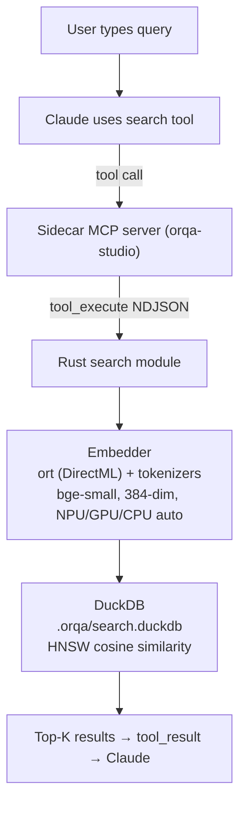

**Date:** 2026-03-04 | **Updated:** 2026-03-10 | **Status:** Current | **References:** Rust Modules, IPC Commands, Tool Definitions

Built-in semantic code search with no external dependencies. The entire search stack — code chunking, ONNX embeddings, vector store, and search API — runs natively in OrqaStudio™'s Rust backend.

---

## 1. Architecture Overview



**Design principle:** Zero configuration. OrqaStudio indexes the codebase, embeds chunks, and searches — all within the Tauri process. No external servers, no API keys, no Docker containers.

---

## 2. Module Structure

```
backend/src-tauri/src/search/
├── mod.rs           # Public API: SearchEngine struct, init, re-exports
├── store.rs         # DuckDB connection, schema creation, queries
├── chunker.rs       # File walking (.gitignore-aware), code splitting
├── embedder.rs      # ONNX Runtime session, tokenizer, batch embedding
└── types.rs         # SearchResult, ChunkInfo, IndexStatus, EmbedError
```

### Dependency Graph

- `search::mod` → `store`, `chunker`, `embedder`, `types`
- `store` → `duckdb`, `types`
- `chunker` → `ignore` (gitignore-aware walker), `types`
- `embedder` → `ort` (ONNX Runtime + DirectML), `tokenizers`, `types`
- `commands::search_commands` → `search::mod`, `state::AppState`

---

## 3. Data Model

### DuckDB Schema (`.orqa/search.duckdb`)

```sql
CREATE TABLE IF NOT EXISTS chunks (
    id INTEGER PRIMARY KEY,
    file_path TEXT NOT NULL,
    start_line INTEGER NOT NULL,
    end_line INTEGER NOT NULL,
    content TEXT NOT NULL,
    language TEXT,
    embedding FLOAT[384]    -- NULL until embeddings are generated
);

CREATE INDEX idx_chunks_file ON chunks(file_path);
```

**Why DuckDB over SQLite?** DuckDB has native array types and vector similarity functions (`array_cosine_similarity`), eliminating the need for a separate vector database or extension. The search database is separate from the main application SQLite database.

### Types

```rust
/// A single code chunk from the indexed codebase.
pub struct ChunkInfo {
    pub file_path: String,
    pub start_line: u32,
    pub end_line: u32,
    pub content: String,
    pub language: Option<String>,
}

/// A search result with relevance score.
pub struct SearchResult {
    pub file_path: String,
    pub start_line: u32,
    pub end_line: u32,
    pub content: String,
    pub language: Option<String>,
    pub score: f64,           // cosine similarity (semantic) or match count (regex)
    pub match_context: String, // highlighted match or surrounding context
}

/// Status of the search index.
pub struct IndexStatus {
    pub is_indexed: bool,
    pub chunk_count: u32,
    pub has_embeddings: bool,
    pub last_indexed: Option<String>,  // ISO 8601 timestamp
    pub index_path: String,
}
```

---

## 4. Code Chunking Strategy

**Approach:** Line-based splitting with language-aware boundary detection.

1. **File walking:** Uses the `ignore` crate which respects `.gitignore`, `.git/info/exclude`, and global gitignore. Also respects project `excluded_paths` from `.orqa/project.json`.
2. **File filtering:** Skip binary files, files > 1MB, and non-text extensions.
3. **Splitting heuristic:**
   - Target chunk size: 20-100 lines
   - Split at blank line + indent change boundaries (rough function/block detection)
   - Each chunk is a complete logical unit (no mid-function splits when possible)
   - Overlapping context: 2 lines before/after each chunk boundary for search continuity
4. **Metadata:** Each chunk stores file path, line range, raw content, and detected language.

**Language detection:** Infer from file extension (`.rs` → Rust, `.ts` → TypeScript, `.svelte` → Svelte, etc.). No heavyweight analysis needed.

---

## 5. Embedding Model

### Model Choice: BAAI/bge-small-en-v1.5

| Property | Value |
|----------|-------|
| Dimensions | 384 |
| Model size | ~130MB (ONNX format) |
| Context window | 512 tokens |
| Architecture | BERT-based |
| License | MIT |

**Why bge-small?** Best tradeoff of quality vs. size for local code search. The 384-dim embeddings are small enough for fast similarity search while maintaining good semantic quality.

### Hardware Acceleration

ONNX Runtime with **DirectML execution provider**:

- **NPU:** Copilot+ PCs with Qualcomm/Intel/AMD NPUs — best efficiency
- **GPU:** Discrete or integrated graphics via DirectX 12 — good throughput
- **CPU:** Automatic fallback on older hardware — always works

DirectML auto-routes to the best available hardware. No user configuration needed.

```rust
let session = Session::builder()?
    .with_execution_providers([ort::DirectMLExecutionProvider::default().build()])?
    .with_optimization_level(GraphOptimizationLevel::Level3)?
    .commit_from_file(model_dir.join("model.onnx"))?;
```

### Model Distribution

**Production (installer build):**
- The ONNX model files (`model.onnx`, `tokenizer.json`) are **bundled with the OrqaStudio installer**
- This adds ~130MB to the installer size
- The bundled model is placed in the app's resource directory during installation
- Build pipeline must include a step to download/verify the model before packaging
- Tauri's `resources` configuration in `tauri.conf.json` handles bundling

**Development (first-use download):**
- On first use, if the model is not found in the resource directory, OrqaStudio downloads it from Hugging Face to the app data directory (`{app_data}/orqa-studio/models/bge-small-en-v1.5/`)
- Download progress is reported via Tauri events for UI feedback
- The model is cached — subsequent runs use the cached copy
- A hash check verifies model integrity after download

**Model files required:**
- `model.onnx` (~130MB) — the ONNX-format model weights
- `tokenizer.json` (~700KB) — the tokenizer vocabulary and config

---

## 6. Search Modes

### Regex Search

Text-based pattern matching against indexed chunks. Available as soon as the codebase is indexed (no embeddings needed).

```rust
pub fn search_regex(
    pattern: &str,
    path: Option<&str>,
    max_results: u32,
) -> Result<Vec<SearchResult>, SearchError>
```

- Compiles the pattern as a Rust regex
- Searches chunk content in DuckDB
- Optional path filter narrows to specific directories
- Returns matching chunks sorted by file path, then line number

### Semantic Search

Vector similarity search against embedded chunks. Requires both indexing and embedding.

```rust
pub fn search_semantic(
    query: &str,
    max_results: u32,
) -> Result<Vec<SearchResult>, SearchError>
```

- Embeds the query string using the same bge-small model
- Uses DuckDB's `array_cosine_similarity()` to find nearest chunks
- Returns top-K chunks sorted by cosine similarity score
- Only searches chunks that have embeddings (non-NULL embedding column)

### Code Research

Combines regex and semantic search, merging the top results from both into a single response. The query is used as-is for semantic search; for the regex pass the query is treated as a literal pattern (special regex characters are escaped). Results from both modes are returned together so Claude can synthesise a coherent analysis of the codebase.

Implemented in `backend/src-tauri/src/domain/tool_executor.rs` as `tool_code_research()` and in `backend/src-tauri/src/commands/stream_commands.rs`. Available as the `code_research` MCP tool registered in the sidecar.

---

## 7. IPC Commands

```rust
#[tauri::command]
pub async fn index_codebase(
    state: State<'_, AppState>,
    project_path: String,
    excluded_paths: Vec<String>,
) -> Result<IndexStatus, OrqaError>

#[tauri::command]
pub async fn search_regex(
    state: State<'_, AppState>,
    pattern: String,
    path: Option<String>,
    max_results: Option<u32>,
) -> Result<Vec<SearchResult>, OrqaError>

#[tauri::command]
pub async fn search_semantic(
    state: State<'_, AppState>,
    query: String,
    max_results: Option<u32>,
) -> Result<Vec<SearchResult>, OrqaError>

#[tauri::command]
pub async fn get_index_status(
    state: State<'_, AppState>,
    project_path: String,
) -> Result<IndexStatus, OrqaError>

#[tauri::command]
pub async fn init_embedder(
    state: State<'_, AppState>,
    model_dir: String,
) -> Result<(), OrqaError>
```

All search commands return `Result<T, OrqaError>`. Tauri serialises `OrqaError` to the frontend via the `Serialize` derive on `OrqaError`. This follows the project-wide error propagation pattern (see [AD-1ad08e5f](AD-1ad08e5f)) — no mapping to `String` at the command boundary.

---

## 8. Sidecar Tool Integration

Tools are registered in the orqa-studio MCP server (`sidecar/src/provider.ts`):

| Tool | Sidecar Name | Auto-approve | Description |
|------|-------------|--------------|-------------|
| `search_regex` | `search_regex` | Yes | Regex pattern search over indexed code |
| `search_semantic` | `search_semantic` | Yes | Semantic similarity search |
| `code_research` | `code_research` | Yes | Combined regex + semantic search, results merged |

All search tools are auto-approved (read-only operations). They follow the same `executeToolViaRust` pattern as file/shell tools.

---

## 9. UI Integration

### Settings Panel (ProjectScanningSettings)

- **Status display:** "Not indexed" / "Indexed (N chunks, last updated TIME)" / "Indexed with embeddings (N chunks)"
- **Index button:** Triggers `index_codebase` with a spinner during indexing
- **Progress:** Indexing and embedding progress reported via Tauri events

### Tool Cards

Search tools use the same ToolCallCard component as other tools:
- `search_regex` → "Regex Search" with Regex icon
- `search_semantic` → "Semantic Search" with Brain icon
- `code_research` → "Code Research" with BookOpen icon

---

## 10. Performance Considerations

| Operation | Expected Time | Notes |
|-----------|--------------|-------|
| Index (10K files) | 5-15 seconds | File walking + chunking + DuckDB insert |
| Embed (10K chunks) | 30-120 seconds | Depends on hardware (NPU fastest) |
| Regex search | < 100ms | DuckDB LIKE/regex over text |
| Semantic search | < 200ms | Embed query + DuckDB cosine similarity |

Embedding is the bottleneck. It runs asynchronously via `tokio::spawn_blocking` so the UI remains responsive.

---

## 11. Installer Build Requirements

When building the OrqaStudio installer for distribution:

1. **Download the ONNX model** during the build pipeline (CI/CD step)
2. **Verify model integrity** with SHA-256 checksum
3. **Place model files** in the Tauri resources directory
4. **Configure `tauri.conf.json`** to include the model in the bundle:
   ```json
   {
     "bundle": {
       "resources": [
         "models/bge-small-en-v1.5/model.onnx",
         "models/bge-small-en-v1.5/tokenizer.json"
       ]
     }
   }
   ```
5. **Test on clean install** — verify the model loads from the bundled location without network access

This is a build-time concern, not a runtime concern. The application code checks both the resource directory and the app data directory for the model.

---

## Related Documents

- Rust Module Architecture — module tree and dependency graph
- IPC Commands — command registration and type contracts
- Tool Definitions — MCP tool specifications
- Streaming Pipeline — event flow from sidecar to UI
