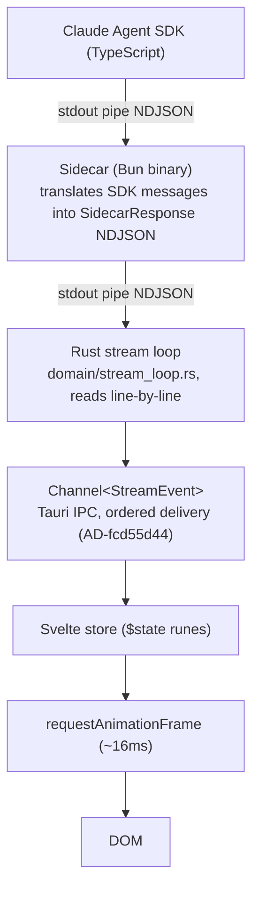

**Date:** 2026-03-02 | **References:** [AD-dc919e52](AD-dc919e52), [AD-fcd55d44](AD-fcd55d44)

End-to-end description of how AI responses stream through the provider sidecar, Rust backend, and into the Svelte UI. The sidecar implements a provider interface — currently using the Claude Agent SDK, with the architecture designed for additional providers. Covers the NDJSON protocol, event types, stream loop mechanics, tool execution, approval gating, and cancellation.

---

## 1. Pipeline Overview



The sidecar adds ~0.1–0.5ms per event, negligible relative to AI token generation latency. `Channel<T>` is Tauri's streaming IPC mechanism — faster than `emit`/`listen`, with ordered, indexed delivery.

---

## 2. NDJSON Protocol

The sidecar writes one JSON object per line to stdout. Each line is a complete `SidecarResponse`. Rust reads stdout line-by-line. The delimiter is a newline character — no framing, no length prefix.

Requests flow in the reverse direction: Rust writes `SidecarRequest` objects to the sidecar's stdin, one per line.

### Protocol Types

Both sides of the protocol are defined in two mirrored files:

| Layer | File |
|-------|------|
| Rust | `backend/src-tauri/src/sidecar/types.rs` — `SidecarRequest` and `SidecarResponse` enums |
| TypeScript | `sidecar/src/protocol.ts` — matching interfaces and union types |

These files must stay in sync. A change to one requires a matching change to the other.

---

## 3. SidecarResponse Variants

The `SidecarResponse` enum (Rust) / union type (TypeScript) carries all events emitted by the sidecar on stdout. Variants use `snake_case` `type` tags via serde `rename_all`.

### Streaming content

| Variant | Fields | Description |
|---------|--------|-------------|
| `stream_start` | `message_id: i64`, `resolved_model: Option<String>` | Marks the start of a turn. `message_id` links to the persisted message row. |
| `text_delta` | `content: String` | A chunk of assistant response text. |
| `thinking_delta` | `content: String` | A chunk of extended thinking content (only when `enable_thinking` is true). |
| `tool_use_start` | `tool_call_id: String`, `tool_name: String` | Signals that a tool call has begun. |
| `tool_input_delta` | `tool_call_id: String`, `content: String` | Incremental JSON fragment of the tool input. |
| `tool_result` | `tool_call_id: String`, `tool_name: String`, `result: String`, `is_error: bool` | The completed tool result. |
| `block_complete` | `block_index: i32`, `content_type: String` | A content block (text or tool_use) has finished streaming. |
| `turn_complete` | `input_tokens: i64`, `output_tokens: i64` | End of turn with token counts. Terminal event. |
| `stream_error` | `code: String`, `message: String`, `recoverable: bool` | An error occurred. Terminal event. |
| `stream_cancelled` | — | Stream was cancelled by the client. Terminal event. |

### Tool execution

| Variant | Fields | Description |
|---------|--------|-------------|
| `tool_execute` | `tool_call_id: String`, `tool_name: String`, `input: String` | Sidecar asks Rust to execute a tool. Handled synchronously in the stream loop — not forwarded to the frontend. |
| `tool_approval_request` | `tool_call_id: String`, `tool_name: String`, `input: String` | Sidecar asks whether a write/execute tool is approved. Forwarded to the frontend as a `StreamEvent::ToolApprovalRequest`. |

### Lifecycle

| Variant | Fields | Description |
|---------|--------|-------------|
| `session_initialized` | `session_id: i64`, `provider_session_id: String` | The Agent SDK has assigned a provider session UUID. Rust persists this to SQLite. Not forwarded to the frontend. |
| `health_ok` | `version: String` | Health check response. Not forwarded to the frontend. |
| `summary_result` | `session_id: i64`, `summary: String` | Response to a `generate_summary` request. Not forwarded to the frontend. |

---

## 4. SidecarRequest Variants

Rust writes `SidecarRequest` objects to the sidecar's stdin.

| Variant | Fields | Description |
|---------|--------|-------------|
| `send_message` | `session_id`, `content`, `model`, `system_prompt`, `provider_session_id`, `enable_thinking` | Begin a new turn. `provider_session_id` is set when resuming a session after restart. |
| `cancel_stream` | `session_id` | Abort the active stream for this session. |
| `health_check` | — | Request a `health_ok` response. |
| `generate_summary` | `session_id`, `messages: Vec<MessageSummary>` | Request a short conversation title. |
| `tool_result` | `tool_call_id`, `output`, `is_error` | Return the result of a `tool_execute` dispatch to the sidecar. |
| `tool_approval` | `tool_call_id`, `approved`, `reason` | Return the user's approval decision for a `tool_approval_request`. |

---

## 5. StreamEvent (Frontend-Facing Type)

`StreamEvent` is the Rust enum defined in `backend/src-tauri/src/domain/provider_event.rs`. It is what flows over `Channel<StreamEvent>` to the Svelte frontend. It is a filtered, transformed subset of `SidecarResponse`.

`StreamEvent` has 15 variants:

| Variant | Notes |
|---------|-------|
| `StreamStart` | Forwarded from `SidecarResponse::StreamStart` |
| `TextDelta` | Forwarded from `SidecarResponse::TextDelta` |
| `ThinkingDelta` | Forwarded from `SidecarResponse::ThinkingDelta` |
| `ToolUseStart` | Forwarded from `SidecarResponse::ToolUseStart` |
| `ToolInputDelta` | Forwarded from `SidecarResponse::ToolInputDelta` |
| `ToolResult` | Forwarded from `SidecarResponse::ToolResult` |
| `BlockComplete` | Forwarded from `SidecarResponse::BlockComplete` |
| `TurnComplete` | Forwarded from `SidecarResponse::TurnComplete` |
| `StreamError` | Forwarded with optional friendly message substitution for context overflow errors |
| `StreamCancelled` | Forwarded from `SidecarResponse::StreamCancelled` |
| `ToolApprovalRequest` | Forwarded from `SidecarResponse::ToolApprovalRequest` — triggers the UI approval dialog |
| `ProcessViolation` | Generated by Rust after turn completion when a process compliance check fails |
| `SessionTitleUpdated` | Generated by Rust when auto-title is computed from conversation content |
| `SystemPromptSent` | Generated by Rust at turn start, carries governance prompt and char count |
| `ContextInjected` | Generated by Rust when prior messages are injected as context |

`SidecarResponse::ToolExecute`, `SidecarResponse::HealthOk`, `SidecarResponse::SummaryResult`, and `SidecarResponse::SessionInitialized` are consumed by Rust and do not produce `StreamEvent` entries.

---

## 6. Stream Loop

The stream loop is implemented in `backend/src-tauri/src/domain/stream_loop.rs`. It is the central Rust component that drives a conversation turn.

### Entry point

`run_stream_loop(state, on_event)` — called by the `stream_send_message` Tauri command after the sidecar has been sent a `send_message` request. Returns a `StreamAccumulator` containing the final text, token counts, and error/complete flags.

### Loop mechanics

```
loop {
    response = state.sidecar.read_line()   // blocking read from sidecar stdout
    if SessionInitialized → persist provider_session_id to SQLite, continue
    if ToolExecute        → handle_tool_execute(), send tool_result back, continue
    if ToolApprovalRequest → handle_tool_approval(), block on user decision, continue
    accumulate_response()                   // update text/token accumulators
    if translate_response() → Some(event)  // filter + map to StreamEvent
        on_event.send(event)               // emit to frontend via Channel<T>
    if is_terminal(response) → break
}
```

### Tool execution path

When the sidecar emits `ToolExecute`:

1. `handle_tool_execute()` calls `execute_tool(tool_name, input, state)` in `domain/tool_executor.rs`
2. The result (text output + is_error flag) is truncated to 100,000 chars if needed
3. A `SidecarRequest::ToolResult` is written to the sidecar's stdin
4. The tool call is recorded in `process_state` for compliance checking
5. The loop continues — `ToolExecute` events are not forwarded to the frontend

### Tool approval path

When the sidecar emits `ToolApprovalRequest`:

1. Read-only tools (`read_file`, `glob`, `grep`, `search_regex`, `search_semantic`, `load_skill`, `code_research`) are auto-approved immediately
2. Write/execute tools (`write_file`, `edit_file`, `bash`) emit a `StreamEvent::ToolApprovalRequest` to the frontend
3. The stream loop blocks on a `mpsc::sync_channel` waiting for the frontend to call `stream_tool_approval_respond`
4. The approval decision is sent back to the sidecar as `SidecarRequest::ToolApproval`

### Cancellation

The `stream_cancel` Tauri command sends a `SidecarRequest::CancelStream` to the sidecar. The sidecar calls `abortController.abort()`, which causes the Agent SDK's `query()` iterator to stop. The sidecar emits `stream_cancelled`, which the stream loop treats as a terminal event.

---

## 7. Sidecar Implementation

The sidecar is a Bun-compiled binary (`sidecar/`) that wraps the Claude Agent SDK.

### Provider interface

`sidecar/src/provider-interface.ts` defines the `Provider` interface. `ClaudeAgentProvider` in `sidecar/src/providers/claude-agent.ts` is the current implementation. Adding a new AI provider means implementing this interface without changing Rust or Svelte code.

### Tool routing via MCP

The sidecar creates an in-process MCP server using `createSdkMcpServer()` from the Agent SDK. It registers 10 tools:

| Tool | Description |
|------|-------------|
| `read_file` | Read file contents with optional offset/limit |
| `write_file` | Write or create a file |
| `edit_file` | Replace a string in a file (requires unique match) |
| `bash` | Execute a shell command |
| `glob` | Find files matching a glob pattern |
| `grep` | Search file contents with a regex |
| `search_regex` | Search the indexed codebase with a regex pattern |
| `search_semantic` | Search the indexed codebase with natural language |
| `code_research` | Combined regex + semantic search for architectural understanding |
| `load_skill` | Load a project skill document by name |

Every tool call invokes `executeToolViaRust()`, which:
1. Emits a `tool_execute` NDJSON line to stdout
2. Emits a `tool_use_start` NDJSON line (for frontend tracking)
3. Waits for a `tool_result` on stdin (from Rust)
4. Emits a `tool_result` NDJSON line (for frontend display)
5. Returns the output to the Agent SDK as an MCP tool result

### Session continuity

The Agent SDK uses its own UUIDs for conversation sessions. When a session starts, the sidecar captures the UUID from the SDK's `init` message and sends it to Rust as `session_initialized`. Rust persists this mapping to SQLite. On subsequent messages in the same session, Rust includes the stored UUID in `send_message` as `provider_session_id`, and the sidecar passes it to `query()` as `resume`. This allows conversation history to survive app restarts.

### Tool approval via canUseTool

The Agent SDK's `canUseTool` callback is the approval gate for all tool calls. The sidecar emits `tool_approval_request` for every tool. Rust's stream loop auto-approves read-only tools immediately; write/execute tools block until user approval arrives via `stream_tool_approval_respond`.

---

## 8. Error Handling

`StreamError` events carry a `code`, `message`, and `recoverable` flag.

| Error code | Cause | Recoverable |
|-----------|-------|-------------|
| `rate_limit` | API rate limit hit | true |
| `overloaded` | Provider overloaded | true |
| `auth_error` | Claude Code CLI not authenticated | false |
| `cli_not_found` | Claude Code CLI binary missing | false |
| `cancelled` | Stream was aborted | false |
| `sdk_error` | General Agent SDK error | false |
| `sidecar_eof` | Sidecar process closed unexpectedly | false |
| `sidecar_read_error` | I/O error reading sidecar stdout | false |
| `context_length_exceeded` | Model context window exceeded | false |

Context overflow errors are intercepted in `translate_response()` and given a user-friendly message: "The conversation has exceeded the model's context window. Start a new session to continue, or summarize earlier context before proceeding."

---

## Related Documents

- Architecture Decisions — [AD-dc919e52](AD-dc919e52) (sidecar architecture), [AD-fcd55d44](AD-fcd55d44) (Channel<T> for streaming)
- Tool Definitions — Tool schemas, security model, and in-process execution
- Streaming Pipeline — this document

---
