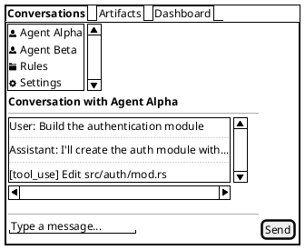

**Date:** 2026-03-02
**References:** [Wireframing Research](RES-11bee8a4) (Q1 verdict: PlantUML Salt), SQLite Schema, Design System

How OrqaStudio™ stores, renders, caches, and serves PlantUML Salt wireframes as themed images within its Tauri WebView.

---


## Overview

Wireframing is a first-class product feature. OrqaStudio's AI agent generates PlantUML Salt source files during UX design sessions, and OrqaStudio renders them to PNG/SVG images on demand. The rendering pipeline supports three style variants (light, dark, brand) backed by a SQLite image cache. A custom markdown syntax (`orqa://wireframe/...`) embeds wireframes into documentation rendered in the WebView.

```
Salt source file (.puml)
        |
        v
  [Source hash + variant] --cache hit--> Serve cached image
        |
        | cache miss
        v
  [PlantUML renderer] --> PNG/SVG
        |
        v
  [Write to disk + register in SQLite cache]
        |
        v
  Serve via local HTTP / file:// to WebView
```

---


## Salt Source File Storage

Wireframe source files live on disk alongside the documentation they illustrate, under the project's `docs/` tree.

### Directory Convention

```
docs/
  ui/
    wireframes/
      core-layout.puml
      conversation-view.puml
      artifact-browser.puml
      settings-panel.puml
    screens/
      ...
  architecture/
    diagrams/
      ...
```

### File Format

Each `.puml` file contains a single `@startsalt` / `@endsalt` block with optional `<style>` directives. Source files are the canonical representation. Rendered images are derived artifacts, never edited directly.



### Source File Discovery

The Rust backend discovers wireframe sources by scanning for `*.puml` files that contain `@startsalt`. Files without `@startsalt` are treated as general PlantUML diagrams (sequence, class, etc.) and are not part of the wireframe pipeline.

---


## SQLite Image Cache

Rendered wireframe images are cached in SQLite to avoid re-rendering unchanged sources. This table is added to `orqa.db` alongside the existing schema.

### Table Definition

```sql
CREATE TABLE wireframe_cache (
    id              INTEGER PRIMARY KEY,
    project_id      INTEGER NOT NULL REFERENCES projects(id) ON DELETE CASCADE,
    wireframe_name  TEXT NOT NULL,               -- logical name, e.g. "core-layout"
    source_path     TEXT NOT NULL,               -- relative path: "docs/wireframes/core-layout.puml"
    source_hash     TEXT NOT NULL,               -- SHA-256 of .puml file content
    style_variant   TEXT NOT NULL                -- "light", "dark", "brand"
                    CHECK (style_variant IN ('light', 'dark', 'brand')),
    theme_hash      TEXT,                        -- SHA-256 of theme tokens (brand variant only)
    image_format    TEXT NOT NULL DEFAULT 'png'
                    CHECK (image_format IN ('png', 'svg')),
    image_path      TEXT NOT NULL,               -- relative path to rendered image on disk
    image_size      INTEGER,                     -- file size in bytes
    rendered_at     TEXT NOT NULL DEFAULT (strftime('%Y-%m-%dT%H:%M:%fZ', 'now')),
    render_duration_ms INTEGER                   -- how long PlantUML took
);

CREATE UNIQUE INDEX idx_wireframe_cache_lookup
    ON wireframe_cache(project_id, source_hash, style_variant, image_format);

CREATE INDEX idx_wireframe_cache_name
    ON wireframe_cache(project_id, wireframe_name);
```

### Cache Directory

Rendered images are stored under the project's OrqaStudio data directory:

```
.orqa/
  cache/
    wireframes/
      core-layout.light.png
      core-layout.dark.png
      core-layout.brand.png
      core-layout.light.svg
      conversation-view.light.png
      ...
```

The `image_path` column stores the path relative to the project root (e.g., `.orqa/cache/wireframes/core-layout.light.png`).

### Migration

This table is added as a new migration file:

```sql
-- backend/src-tauri/migrations/003_wireframe_cache.sql
CREATE TABLE IF NOT EXISTS wireframe_cache (
    -- (full definition as above)
);
```

---


## Style Variants

Each wireframe can be rendered in three visual variants. The variant determines the PlantUML `<style>` block injected before rendering.

### Light

Default wireframe aesthetic. White/light gray background, dark text. Uses OrqaStudio's light mode design tokens.

```plantuml
<style>
salt {
  BackgroundColor #FFFFFF
  FontColor #1A1A1A
  LineColor #E5E5E5
  FontName Inter
  FontSize 14
}
</style>
```

Token mapping from the design system:
- Background: `--background` = `oklch(1 0 0)` -> `#FFFFFF`
- Foreground: `--foreground` = `oklch(0.145 0 0)` -> approximately `#252525`
- Border: `--border` = `oklch(0.922 0 0)` -> approximately `#E8E8E8`

### Dark

Dark background, light text. Uses OrqaStudio's dark mode design tokens.

```plantuml
<style>
salt {
  BackgroundColor #252525
  FontColor #FAFAFA
  LineColor #404040
  FontName Inter
  FontSize 14
}
</style>
```

Token mapping:
- Background: `--background` (dark) = `oklch(0.145 0 0)` -> approximately `#252525`
- Foreground: `--foreground` (dark) = `oklch(0.985 0 0)` -> approximately `#FAFAFA`
- Border: `--border` (dark) = `oklch(0.269 0 0)` -> approximately `#404040`

### Brand

Uses the active project's extracted theme colors from the `project_themes` table. Falls back to OrqaStudio's indigo-violet primary if no project theme is active.

```plantuml
<style>
salt {
  BackgroundColor #FFFFFF
  FontColor #1A1A1A
  LineColor #E5E5E5
  FontName Inter
  FontSize 14
  HyperlinkColor {project_primary_hex}
}
</style>
```

The brand variant reads from the theme resolution chain defined in the design system: `User Override > Extracted Project Token > OrqaStudio Default Theme`. The `--primary` token value is converted from OKLCH to hex for PlantUML compatibility.

### Style Template Generation

A Rust function generates the appropriate `<style>` block by:

1. Reading the target variant (`light`, `dark`, `brand`)
2. Resolving design tokens from SQLite (`project_themes` + `project_theme_overrides`)
3. Converting OKLCH values to hex (PlantUML does not understand OKLCH)
4. Producing a `<style>` string that is prepended to the Salt source before rendering

```rust
fn generate_style_block(variant: StyleVariant, theme: Option<&ProjectTheme>) -> String {
    match variant {
        StyleVariant::Light => LIGHT_STYLE_TEMPLATE.to_string(),
        StyleVariant::Dark => DARK_STYLE_TEMPLATE.to_string(),
        StyleVariant::Brand => {
            let primary = theme
                .and_then(|t| resolve_primary_hex(t))
                .unwrap_or(ORQA_DEFAULT_PRIMARY_HEX);
            BRAND_STYLE_TEMPLATE.replace("{primary}", &primary)
        }
    }
}
```

---


## On-Demand Generation

Wireframes are rendered lazily. No background batch processing. The rendering pipeline is triggered when a wireframe image is requested (via the custom markdown syntax or the UI) and a valid cache entry does not exist.

### Request Flow

```
1. WebView requests:  orqa://wireframe/core-layout?theme=dark&format=png
2. Rust handler extracts: name="core-layout", variant="dark", format="png"
3. Resolve source file: scan docs/ for core-layout.puml containing @startsalt
4. Compute source_hash: SHA-256 of file content
5. Query cache:
     SELECT image_path FROM wireframe_cache
     WHERE project_id = ? AND source_hash = ? AND style_variant = 'dark' AND image_format = 'png'
6a. Cache HIT  -> return image_path, serve file
6b. Cache MISS -> render pipeline:
      i.   Generate style block for "dark" variant
      ii.  Prepend style block to Salt source
      iii. Invoke PlantUML to render PNG
      iv.  Write PNG to .orqa/cache/wireframes/core-layout.dark.png
      v.   INSERT into wireframe_cache
      vi.  Return image_path, serve file
```

### Concurrency

If multiple requests arrive for the same uncached wireframe simultaneously, the Rust backend uses a per-wireframe mutex (keyed by `(source_path, variant, format)`) to ensure only one render executes. Subsequent requests wait for the first render to complete and then serve from cache.

---


## Custom Markdown Rendering Block

Wireframes are embedded in markdown documentation using a custom URI scheme that the OrqaStudio markdown renderer intercepts.

### Syntax

```markdown

```

Parameters:
- `{name}` — The wireframe's logical name, matching the `.puml` filename without extension (e.g., `core-layout`)
- `{variant}` — Style variant: `light`, `dark`, or `brand`. Defaults to the user's current mode (light/dark) if omitted.
- `format` — Optional. `png` (default) or `svg`. Example: `orqa://wireframe/core-layout?theme=dark&format=svg`

### Examples

```markdown
## Core Layout

The three-zone + nav sub-panel layout arranges Activity Bar, Nav Sub-Panel, Explorer Panel, and Chat Panel:


In dark mode:


With the project's brand colors applied:


```

### Markdown Renderer Integration

The `MarkdownRenderer` Svelte component (from the design system's custom component list) intercepts `orqa://wireframe/` URLs in image nodes during rendering:

1. Parse the `orqa://wireframe/{name}` URL and extract query parameters
2. If `theme` is omitted, detect current mode from `mode-watcher` (light or dark)
3. Issue a Tauri command (`invoke('get_wireframe_image', { name, variant, format })`)
4. The Rust backend returns either a cached image path or triggers on-demand generation
5. The resolved image is displayed via an `` tag pointing at the local serving URL

If the source `.puml` file does not exist, the renderer displays a placeholder with the text "Wireframe not found: {name}" styled as `text-muted-foreground`.

---


## PlantUML Execution

### Invocation

OrqaStudio invokes PlantUML as an external process. The exact binary depends on the bundling strategy (see PlantUML Bundling Spike).

```rust
use std::process::Command;

fn render_wireframe(
    plantuml_bin: &Path,    // path to plantuml binary or JAR
    source: &str,           // full Salt source with style block prepended
    output_path: &Path,     // target image file
    format: ImageFormat,    // Png or Svg
) -> Result<(), RenderError> {
    let format_flag = match format {
        ImageFormat::Png => "-tpng",
        ImageFormat::Svg => "-tsvg",
    };

    // Write styled source to a temp file
    let temp_input = temp_dir().join("orqa_wireframe_input.puml");
    std::fs::write(&temp_input, source)?;

    let status = Command::new(plantuml_bin)
        .args(&[format_flag, "-o", output_path.parent().unwrap().to_str().unwrap()])
        .arg(&temp_input)
        .stdout(Stdio::piped())
        .stderr(Stdio::piped())
        .status()?;

    if !status.success() {
        return Err(RenderError::PlantUmlFailed { exit_code: status.code() });
    }

    // PlantUML writes output alongside input with matching extension;
    // move to the desired output_path if needed
    let plantuml_output = temp_input.with_extension(format.extension());
    std::fs::rename(&plantuml_output, output_path)?;

    Ok(())
}
```

### Binary Resolution Order

The Rust backend locates the PlantUML binary using this precedence:

1. **Bundled native binary** (GraalVM-compiled) — `{app_resources}/plantuml` (preferred)
2. **Bundled JAR with bundled JRE** — `{app_resources}/jre/bin/java -jar {app_resources}/plantuml.jar`
3. **Bundled JAR with system JRE** — `java -jar {app_resources}/plantuml.jar` (fallback)
4. **System PlantUML** — `plantuml` on PATH (development fallback)

If no working PlantUML binary is found, OrqaStudio displays an error in the UI with instructions for installing Java or PlantUML. This should never happen in production builds (bundling ensures availability).

### Rendering Performance

PlantUML Salt rendering for typical wireframes:
- Cold start (JVM launch): ~1-2 seconds
- Warm rendering (JVM already running): ~200-500ms
- Native binary (GraalVM): ~100-300ms with no cold start

For the JRE-based path, OrqaStudio may keep a long-running PlantUML process using `-pipe` mode to avoid repeated JVM startup costs:

```bash
# Pipe mode: PlantUML reads from stdin, writes image to stdout
echo "@startsalt ... @endsalt" | java -jar plantuml.jar -pipe -tpng > output.png
```

---


## Cache Invalidation

The cache is invalidated when the inputs to rendering change: either the source file or the theme tokens.

### Source Change Invalidation

When OrqaStudio detects that a `.puml` file has been modified (via file watcher or on-access hash check):

```sql
-- Delete all cached variants for the changed source
DELETE FROM wireframe_cache
WHERE project_id = ? AND source_path = ?;
```

The corresponding image files on disk are also deleted. The next request for any variant of that wireframe triggers a fresh render.

### Detection Mechanism

Two complementary approaches:

1. **On-access check** — When a wireframe is requested, compute the current SHA-256 of the source file and compare against `source_hash` in the cache row. If mismatched, invalidate and re-render. This is the primary mechanism and guarantees correctness.

2. **File watcher (optional optimization)** — A `notify`-based file watcher on the `docs/` directory detects `.puml` file changes and proactively invalidates cache rows. This allows the UI to show a "stale" indicator before the wireframe is re-requested.

### Theme Change Invalidation

When project theme tokens change (detected by the `source_hash` column in `project_themes` changing), all brand-variant cache entries for that project are invalidated:

```sql
-- Delete all brand-variant caches when theme changes
DELETE FROM wireframe_cache
WHERE project_id = ? AND style_variant = 'brand';
```

Light and dark variants use OrqaStudio's static design tokens, so they are only invalidated on OrqaStudio version upgrades (when the built-in style templates may change).

### Manual Invalidation

A Tauri command is exposed for manual cache clearing:

```rust
#[tauri::command]
fn clear_wireframe_cache(project_id: i64, name: Option<String>) -> Result<(), Error> {
    // If name is provided, clear only that wireframe's cache
    // If name is None, clear all wireframes for the project
    // Delete both SQLite rows and image files on disk
}
```

---


## Image Serving to WebView

The rendered wireframe images must be accessible to Tauri's WebView for display in `` tags.

### Option A: Tauri Custom Protocol (Preferred)

Register a custom protocol handler in Tauri that serves files from the cache directory:

```rust
// backend/src-tauri/src/lib.rs
tauri::Builder::default()
    .register_asynchronous_uri_scheme_protocol("orqa", |_ctx, request, responder| {
        // Parse: orqa://wireframe/core-layout?theme=dark&format=png
        // Resolve to .orqa/cache/wireframes/core-layout.dark.png
        // Return file contents with appropriate Content-Type
    })
```

The WebView then references images directly:

```html

```

This approach avoids running a separate HTTP server and integrates naturally with Tauri's security model. The protocol handler triggers the on-demand rendering pipeline if the cache misses.

### Option B: Local HTTP Server (Fallback)

If custom protocols prove unreliable across platforms, a minimal local HTTP server (bound to `127.0.0.1` on a random port) serves static files from the cache directory:

```
http://127.0.0.1:{port}/wireframes/core-layout.dark.png
```

The server port is communicated to the frontend at app startup via a Tauri command.

### Option C: file:// URLs

Direct `file://` URLs to the cache directory. Simplest but may face Content Security Policy restrictions in Tauri's WebView. Not recommended for production.

### Recommendation

Use Tauri's custom protocol handler (Option A). It is the idiomatic approach for serving local resources in Tauri applications, respects the CSP, and unifies the `orqa://wireframe/` URL scheme between the markdown syntax and the serving mechanism.

---


## Summary

| Concern | Approach |
|---------|----------|
| Source storage | `.puml` files on disk in `docs/` alongside documentation |
| Cache storage | SQLite `wireframe_cache` table + image files in `.orqa/cache/wireframes/` |
| Variants | light, dark, brand (project theme colors) |
| Rendering trigger | On-demand when cache misses |
| Markdown syntax | `` |
| PlantUML execution | External process, native binary preferred, JAR fallback |
| Cache invalidation | Source hash mismatch or theme token change |
| Image serving | Tauri custom `orqa://` protocol handler |
