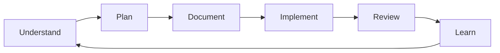
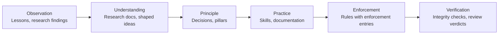

**Date:** 2026-03-02

This page documents the task process: how to start a task, run it, complete it, and hand it off. It does not restate coding standards or architecture decisions -- those live in their own documents and are referenced here.

---

## Session Checklist

Copy and complete at the start of every implementation session:

```text
[ ] Created worktree: git worktree add ../orqa-<task> -b <branch>
[ ] Working in worktree (NOT main)
[ ] Re-read relevant implementation plan and governing docs
[ ] Loaded relevant skills (Skill tool) including orqa-code-search
[ ] Checked `.orqa/process/lessons/` for known patterns in this area
[ ] Ready to write tests FIRST
```

---

## Git Worktree Workflow (MANDATORY)

All agents MUST use worktrees. NO direct work on main.

For the full worktree protocol including background process discipline, Windows-specific process killing, and post-merge verification, see `.orqa/process/rules/git-workflow.md`.

**Quick reference:**

```bash
# 1. START -- Create worktree
git worktree add ../orqa-<task-name> -b <agent>/<task-description>
cd ../orqa-<task-name>

# 2. WORK -- Make changes, commit regularly

# 3. VERIFY -- All checks must pass before review
make check

# 4. REVIEW -- Request code-reviewer approval
# Do NOT merge until approved

# 5. MERGE -- Only after approval
cd ../orqa && git merge <branch>
git branch -d <branch>
git worktree remove ../orqa-<task-name>

# 6. POST-MERGE VERIFICATION
cargo build && npm run build
```

**Branch naming:** `<agent>/<task>` (e.g., `backend/session-commands`, `frontend/scanner-dashboard`)

---

## Merge Conflict Handling (NON-NEGOTIABLE)

Merge conflicts are the primary source of lost work. Every conflict MUST be resolved carefully.

**Resolution rules:**

1. **Task changes take priority** in files the task modified
2. **Preserve unrelated main changes** in shared files
3. **NEVER discard task work** to resolve a conflict
4. **NEVER discard unrelated main work**
5. **Both sides can be correct** -- many conflicts require keeping BOTH sides (two new imports, two new functions)

**Verification after merge:**

1. `git diff HEAD~1 --stat` -- review what actually changed
2. Verify ALL task deliverables are present in the merged code
3. Verify NO unrelated main work was accidentally deleted
4. Run quality checks to catch integration issues
5. If a file was modified by both sides, read the merged result -- do not assume the merge tool got it right

---

## Task Lifecycle Protocol

### Before Starting a Task

1. Check the Definition of Ready -- verify all applicable items
2. Verify the artifact trail -- confirm an `EPIC-NNN` exists with `status: ready` and `docs-required` gate satisfied
3. Check task dependencies in `.orqa/delivery/tasks/` -- ensure the task is not blocked
4. Read the full task description including scope, action, and acceptance criteria
5. Run `code_research` via context-aware search to understand existing code you will modify

### During a Task

1. Follow the plan exactly -- if the plan says "create file X with methods A, B, C", create all three
2. If the plan doesn't work -- document the issue in the task artifact with tag `PLAN_DEVIATION`, do NOT silently change approach
3. Commit regularly -- every meaningful unit of work gets a commit

### After Completing a Task

1. Run acceptance criteria -- execute the specific checks listed for this task
2. Verify the Definition of Done -- all applicable items must be satisfied
3. Request review from `code-reviewer`, then `qa-tester`, then `ux-reviewer` (if UI-facing)
4. Update the task artifact in `.orqa/delivery/tasks/` -- set `status: done`
5. Update the epic's task checklist and status in `.orqa/delivery/epics/EPIC-NNN.md`
6. Verify all `docs-produced` items from the epic have been created or updated
7. Update the parent milestone's `completed-epics` count if the epic is now `done`
8. Log any new patterns discovered in `.orqa/process/lessons/`

---

## Commit Message Convention

All commits MUST reference the plan task ID:

```text
[2.1] Add session persistence Tauri commands

- Created save_session and load_session commands
- Added SessionState struct with Serialize/Deserialize
- All existing tests pass

Co-Authored-By: Claude <agent>
```

Format: `[task_id] Short description`

---

## Cold Start Protocol

When starting a new session, resuming after context compaction, or picking up a task with no prior context:

1. **Read task artifacts in `.orqa/delivery/tasks/`** -- understand current tasks, priorities, and overall progress
2. **Read `tmp/session-state.md`** -- recover context from the prior session
3. **Read this document** -- understand all workflow rules
4. **Run `code_research`** -- understand relevant existing code before making changes (uses `orqa-code-search` to resolve the right tool for your context)
5. **Read referenced docs** -- any documentation mentioned in the task description
6. **Then begin implementation** -- you now have full context to work without diverging from the plan

---

## Progress Log

**File: `PROGRESS.md` in project root**

The orchestrator MUST maintain a running progress log during overnight/extended sessions.

Format:

```markdown
## Session: YYYY-MM-DD HH:MM

### Completed
- [2.1] Added session persistence commands (commit abc1234)

### In Progress
- [2.5] Scanner dashboard -- 3/5 components implemented

### Blocked
- [2.2] Metrics store -- depends on 2.1 (now unblocked)

### Decisions Made
- 2.3: Used rusqlite instead of sqlx for simpler async-free SQLite access.

### Next Up
- [2.2] Metrics store (unblocked by 2.1 completion)
```

---

## Error Ownership

For the full error ownership policy, see `.orqa/process/rules/error-ownership.md`.

**Summary:** ALL errors are YOUR responsibility. No exceptions.

- Do NOT claim "this error existed before"
- Do NOT skip or ignore failures
- Do NOT commit with failing checks
- Pre-existing errors: fix them as part of your commit

---

## Integration Verification

Before calling ANY existing function, Tauri command, or store method:

1. Read the source -- check actual function signature
2. Check the types -- verify parameter names and types
3. Run `make lint-backend` and `make typecheck` -- catch mismatches immediately

NO backwards compatibility shims. Fix ALL callers in the same commit. See `.orqa/process/rules/error-ownership.md`.

---

## Key Documents

| Document | Purpose |
|----------|---------|
| Coding Standards | Full code quality rules |
| Architecture Decisions | All architecture decisions |
| Team Overview | Agent directory, skill directory |
| Definition of Ready | Task start gate checklist |
| Definition of Done | Task completion gate checklist |
| Orchestration | Orchestrator responsibilities |
| Implementation Lessons | Known patterns and gotchas |
| `.orqa/delivery/tasks/` | Task artifacts with status, scope, and acceptance criteria |

---

## Session Handoff

At session end, the orchestrator writes a handoff note to `tmp/session-state.md` (gitignored).

Template:

```markdown
## Session State -- [date]

### Current Phase
[Phase name from the active plan, or "No active plan"]

### Completed This Session
- [Bullet list of tasks/phases completed]

### Next Actions
- [What the next session should do first]

### Open Questions
- [Anything needing user input]

### Context Notes
- [Key decisions, findings, or constraints the next session needs]
- [Active worktrees, if any]
```

---

## The Thinking Loop

OrqaStudio structures work as a continuous loop: **Understand, Plan, Document, Implement, Review, Learn**. Each step produces artifacts that feed into the next.



This is not a linear waterfall. The loop runs at every scale: within a single task, across an epic, and across a milestone. Learning feeds back into understanding, which improves the next plan.

## From Idea to Delivery

### 1. Capture Ideas

When a future possibility is identified, create an `IDEA-NNN` with `status: captured`. Ideas carry `research-needed` fields listing questions that must be answered.

### 2. Explore and Shape

With user approval, an idea moves to `exploring`. Research artifacts are created to answer the open questions. Once all questions are addressed and the scope is clear, the idea moves to `shaped`.

### 3. Promote to Epic

A shaped idea is promoted to an `EPIC-NNN`. The epic contains the implementation design, documentation gates, and priority assessment. The idea's `evolves-into` field links to the epic.

### 4. Plan Tasks

Within an epic, individual `TASK-NNN` artifacts define the work items. Each task has:
- **Acceptance criteria** defining what "done" means
- **Dependencies** on other tasks
- **Skills** that agents need to load

### 5. Implement

Tasks are assigned to agent roles (Implementer, Designer, Writer). The orchestrator coordinates delegation, ensuring skills are loaded and governing documentation is read before work begins.

### 6. Review

An independent Reviewer verifies each task against its acceptance criteria. The implementing agent cannot self-certify quality. Review verdicts are PASS or FAIL.

### 7. Learn

When reviews reveal patterns (recurring mistakes, non-obvious gotchas), lessons are created in `.orqa/process/lessons/`. Lessons that recur frequently are promoted to rules or skill updates.

## Documentation Gates

Epics enforce documentation at two points:

- **`docs-required`**: Documentation that must exist before implementation starts. The epic cannot move to `ready` without these.
- **`docs-produced`**: Documentation that the work must create or update. The epic cannot be marked `done` without these.

This ensures documentation stays in sync with implementation.

## Integrity Checking

OrqaStudio continuously validates the artifact graph:

- **Broken links**: Cross-references that point to non-existent artifacts
- **Missing inverses**: One-sided relationships (A links to B but B does not link back to A)
- **Dependency violations**: In-progress tasks whose dependencies are not done
- **Planning gaps**: Artifacts without milestone or horizon placement
- **Promotion chain integrity**: Promoted lessons must link to real rules

The dashboard surfaces these as warnings and errors, with suggested actions for resolution.

## The Knowledge Pipeline

The pipeline widget tracks how knowledge matures through stages:



Each stage maps to artifact types:
- **Observation**: Lessons, research findings
- **Understanding**: Research documents, shaped ideas
- **Principle**: Decisions, pillars
- **Practice**: Skills, documentation
- **Enforcement**: Rules with enforcement entries
- **Verification**: Integrity checks, review verdicts

A healthy pipeline shows knowledge flowing through all stages. Bottlenecks indicate areas where knowledge is getting stuck (e.g., many lessons but few rules means the promotion pipeline is blocked).

## Roles

OrqaStudio defines universal roles that can be filled by humans or AI agents:

| Role | Purpose |
|------|---------|
| **Orchestrator** | Coordinates work, manages artifacts, delegates tasks |
| **Implementer** | Builds things (code, configurations, content) |
| **Reviewer** | Checks quality and correctness independently |
| **Researcher** | Investigates questions, gathers information |
| **Planner** | Designs approaches, maps dependencies |
| **Writer** | Creates documentation and specifications |
| **Designer** | Designs interfaces and experiences |

The orchestrator never implements directly. Every implementation task is delegated to the appropriate role with the required skills loaded.

## Related Documents

- Artifact Workflow -- How artifacts flow through the development process
- Artifact Framework -- Artifact schemas and design principles
- Team Overview -- Agent roles and skill assignments
- Orchestration -- Orchestrator responsibilities and context discipline
- Definition of Ready -- What must be true before work starts
- Definition of Done -- What must be true before work is complete
- Implementation Lessons -- Known implementation patterns and gotchas
- Process Retrospectives -- Process-level lessons and changes
